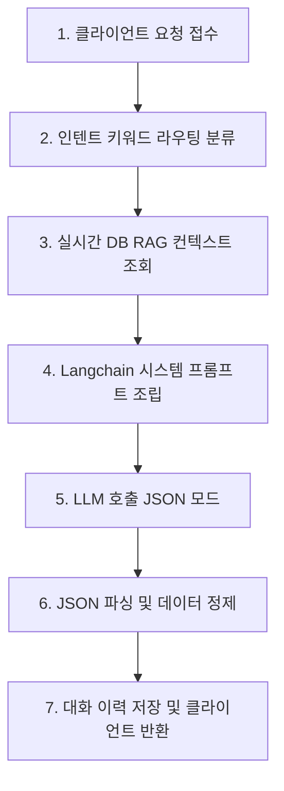

# 🔗 챗봇 랭체인 파이프라인 및 프롬프트 명세서

이 문서는 채권 정보제공 서비스에 적용된 AI 챗봇의 백엔드 처리 단계(Chain Lifecycle), 프롬프트 템플릿, 사용 모델 및 데이터 가공 흐름을 명세합니다.

---

## 1. 챗봇 실행 동작 순서 (Pipeline Steps)

챗봇 API([views.py](file:///C:/Users/SSAFY/Desktop/de_pjt/backend-pjt/apps/chat/views.py))가 호출되었을 때 백엔드([services.py](file:///C:/Users/SSAFY/Desktop/de_pjt/backend-pjt/apps/chat/services.py))에서 수행되는 처리 체인의 순서는 다음과 같습니다.



### **Step 1: 클라이언트 요청 접수**
* 수신 데이터: `session_id`, `message`, `current_page`, `page_params`
* 사용자가 현재 머무르고 있는 웹 브라우저의 화면 정보(`detail`, `dictionary` 등)와 라우팅 파라미터가 백엔드로 전달됩니다.

### **Step 2: 인텐트 키워드 라우팅 (주제 분류)**
* 입력 질문에 따라 의도에 맞는 서브 카테고리를 분류합니다.
* **분류 카테고리**:
  * `Concept` (채권 개념/용어)
  * `Indicators` (금리 및 거시경제 지표)
  * `Compare` (채권 상품 간 비교)
  * `Credit` (발행사 신용평가 및 위험도)
  * `Disclosure` (DART 공시 및 콜/풋옵션 세부사항)
  * `Search` (채권 탐색 및 필터링 가이드)
  * `General` (일반 채권 Q&A)

### **Step 3: 실시간 데이터베이스 조회 (RAG Context)**
주제 분류와 현재 화면 맥락에 맞추어 실제 데이터베이스 테이블에서 실시간 배경지식 데이터를 조회하여 LLM에 프롬프트로 주입합니다.
* **용어 조회 (`Concept` / `dictionary`)**: 질문 단어와 매칭되는 단어를 `Glossary` 테이블에서 검색하여 설명과 예시를 수집합니다.
* **시장금리 조회 (`Indicators` / `indicators`)**: `BaseRate` 테이블에서 국가별 최신 기준금리, 국채금리(3년물/10년물) 정보를 가져옵니다.
* **뉴스 조회 (`news`)**: `News` 테이블에서 최신 수집된 채권 뉴스의 헤드라인과 요약을 수집합니다.
* **채권 상세 조회 (`detail`)**: `bondId` 수신 시 [selectors.get_bond](file:///C:/Users/SSAFY/Desktop/de_pjt/backend-pjt/apps/bonds/selectors.py#L213)를 호출하여 해당 채권의 DB 레코드 데이터(금리, 발행사, 등급 등)를 조회합니다.

### **Step 4: 랭체인 메시지 조립 (Prompt Assembly)**
* 시스템 프롬프트(`SYSTEM_POLICY`) + 분류된 주제별 상세 가이드라인([TOPIC_GUIDELINES](file:///C:/Users/SSAFY/Desktop/de_pjt/backend-pjt/apps/chat/services.py#L36-L45)) + **[Step 3]의 실시간 DB 조회 결과** + 현재 화면 정보 + 대화 이력(최근 8개 대화) + 현재 사용자 질문 순서로 메시지 체인을 최종 조립합니다.

### **Step 5: LLM 호출 (Gemini/OpenAI)**
* 기본 모델: `Gemini 2.5 Flash` (환경변수 `GEMINI_CHAT_MODEL` 참조)
* API Key: `GEMINI_API_KEY` (SSAFY GMS Gateway 경유)
* 구조화된 출력을 보장하기 위해 `response_mime_type: "application/json"` 옵션을 설정하여 응답 형식을 JSON으로 강제합니다.

### **Step 6: JSON 파싱 및 예외 정제**
* LLM에서 응답받은 결과를 [_parse_llm_json](file:///C:/Users/SSAFY/Desktop/de_pjt/backend-pjt/apps/chat/services.py#L67-L93) 정규식 엔진으로 검증/파싱하여 1) 순수 텍스트 답변(`answer`), 2) 추천 이동 카드(`navigation_recommendations`), 3) 다음 예상 질문 목록(`recommended_questions`)을 추출합니다.

---

## 2. 사용된 핵심 프롬프트 (Prompts)

### **1) 기본 시스템 프롬프트 (SYSTEM_POLICY)**
```text
너는 채권 전문 Q&A 챗봇이다. 채권의 개념, 수익률, 듀레이션, 신용등급, 만기, 위험 요소를 쉬운 한국어로 설명한다. 투자 권유처럼 단정하지 말고 정보 제공 관점으로 답한다.

답변은 반드시 아래의 JSON 형식으로 작성해야 한다:
{
  "answer": "여기에 질문에 대한 상세한 답변을 작성하십시오. Markdown 문법을 사용할 수 있습니다. 절대로 이 JSON 구조 바깥에 다른 설명이나 텍스트를 붙여서는 안 됩니다.",
  "navigation_recommendations": [
    {
      "label": "이동 버튼 라벨 (예: '채권 상세정보 보기', '시장지표 페이지로 이동')",
      "type": "navigate",
      "page": "이동할 페이지 이름 ('detail', 'market', 'compare', 'indicators', 'dictionary', 'guide', 'news' 중 하나)",
      "payload": { ... 필요한 경우 파라미터 전달 ... }
    }
  ],
  "recommended_questions": [
    "사용자가 다음에 할 만한 첫 번째 예상 질문",
    "사용자가 다음에 할 만한 두 번째 예상 질문"
  ]
}

규칙:
1. 사용자가 특정 페이지의 기능이나 용어를 탐색하고 싶어할 때만 navigation_recommendations에 이동 링크를 제공하시오. 필요하지 않다면 빈 배열([])이어야 한다.
2. recommended_questions는 항상 2~3개의 구체적이고 채권 지식 탐색에 도움이 되는 다음 예상 질문들을 포함해야 한다.
3. 출력 결과는 다른 부연 설명 없이 오직 위의 JSON 형식 문자열 하나만 반환해야 한다.
```

### **2) 주제별 특화 프롬프트 (TOPIC_GUIDELINES)**
* **Concept (개념 사전)**: "사용자가 채권 개념을 질문했습니다. 채권 초보자도 이해할 수 있도록 예시를 들어 쉽고 친절하게 용어를 설명해 주세요."
* **Indicators (시장 지표)**: "사용자가 거시경제나 시장지표에 대해 질문했습니다. 금리와 채권 가격의 상관관계, 스프레드 동향 등을 바탕으로 거시적 관점에서 답변해 주세요."
* **Compare (채권 비교)**: "사용자가 채권 간 비교를 요청했습니다. 이율, 만기, 신용등급 등 리스크와 수익률 측면의 trade-off를 비교하여 합리적인 판단을 돕도록 설명해 주세요."
* **Credit (신용 평가)**: "사용자가 신용평가나 위험도에 대해 질문했습니다. 신용등급의 의미와 기업 부도 위험성 등을 객관적인 평가지표 관점에서 차분하게 설명해 주세요."
* **Disclosure (옵션/공시)**: "사용자가 공시나 채권 옵션(콜/풋옵션 등)에 대해 질문했습니다. 발행 개요와 옵션의 조건을 세부적으로 설명해 주세요."
* **Search (종목 검색)**: "사용자가 종목 추천이나 검색을 원합니다. 특정 종목을 매수 권유하지 말고, 어떤 기준으로 필터링하여 검색하면 좋은지 가이드를 제공해 주세요."

---

## 3. 사용 모델 및 API 명세 (Models)

* **주 모델**:
  * **Gemini 2.5 Flash** (`gemini-2.5-flash`)
  * LangChain Wrapper: `ChatGoogleGenerativeAI`
* **보조/대체 모델 (Fallback)**:
  * **OpenAI GPT-4o Mini** (`gpt-4o-mini`)
  * LangChain Wrapper: `ChatOpenAI`
* **모델 설정값**:
  * `temperature`: 0.2 (정보 제공의 일관성과 팩트 위주 답변 생성을 위해 저온도 설정)
  * `max_retries`: 0 (신속한 장애 복구 및 Fallback 트리거링을 위함)
