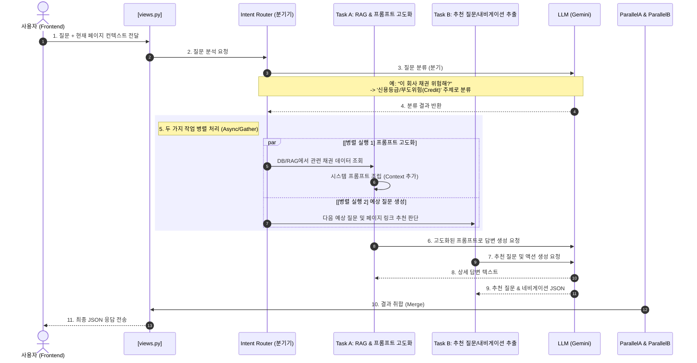

# 🤖 챗봇 내부 동작 로직 설명서 (Chatbot Internal Logic)

이 문서는 채권 정보제공 서비스의 컨텍스트 인식 및 분기형 AI 챗봇이 백엔드에서 어떻게 처리되는지 설명합니다.

---

## 1. 전체 아키텍처 및 처리 흐름 (Sequence Diagram)

---

## 2. 주요 아키텍처 설명

### 1) 페이지 맥락 전달 (Context Injection)
사용자가 현재 머무르고 있는 페이지 정보(`meta.page`)와 관련 파라미터(예: `bondId` 등)를 챗봇 질문 시 페이로드로 전송하여, LLM이 사용자의 탐색 맥락을 인지하게 합니다.

### 2) 주제별 분기 (Intent Routing)
모든 질문을 단일 에이전트가 처리하는 대신, 질문의 의도(개념 사전, 시장 지표, 채권 비교, 신용 평가, 공시 등)를 분석하여 해당 주제의 전문가 서브 에이전트(분기 프롬프트 및 데이터 소스)로 라우팅합니다.

### 3) 병렬 처리 (Parallel Execution)
* **Task A (답변 생성)**: 분류된 주제에 맞는 DB 조회 및 RAG 컨텍스트를 조립하여 최종 답변을 생성합니다.
* **Task B (추천 질문 및 이동 추천)**: 대화 맥락과 관련된 다음 추천 질문 2~3개와, 질문에 연관된 특정 서비스 화면으로 이동할 수 있는 내비게이션 정보(`navigation_recommendations`)를 생성합니다.
* 두 작업을 백엔드에서 비동기로 병렬 처리하여 대기 시간(Latency)을 최소화합니다.

### 4) 실시간 데이터베이스 연동 (Database RAG Context)
챗봇은 주제 분석 및 사용자 화면 상태에 따라 백엔드 데이터베이스를 실시간으로 조회하여 LLM에 배경 지식(컨텍스트)으로 공급합니다:
* **채권 상세 (`detail`)**: `bondId` 파라미터가 들어올 경우, [selectors.py](file:///C:/Users/SSAFY/Desktop/de_pjt/backend-pjt/apps/bonds/selectors.py)를 통해 채권의 상세 스펙(채권명, 발행사, 표면이율, 만기일, 신용등급, 이자지급유형, 옵션 여부)을 직접 조회하여 답변에 활용합니다.
* **개념 사전 (`Concept` / `dictionary`)**: 질문 내 핵심 단어와 매칭되는 단어를 `Glossary` 테이블에서 검색하여 설명과 예시를 컨텍스트로 추가합니다.
* **시장 금리 지표 (`Indicators` / `indicators`)**: `BaseRate` 테이블에서 한국 및 미국의 최신 기준금리, 국채금리(3년물, 10년물), 스프레드 수치 정보를 동적으로 조회하여 답변에 포함시킵니다.
* **시장 뉴스 (`news`)**: `News` 테이블에서 최신 수집된 채권 뉴스 헤드라인과 요약문을 조회하여 제공합니다.

### 5) JSON 모드 강제 및 자동 정제
* 백엔드는 Gemini의 `response_mime_type: "application/json"` 모드를 활성화하여 구조화된 JSON 문자열만 생성하도록 보장합니다.
* 또한, 예외적인 텍스트 노이즈가 발생하더라도 프론트엔드가 오직 정제된 답변만을 노출하도록 정규식을 이용해 JSON 블록과 답변 텍스트를 분류하여 반환합니다.

### 6) 챗봇 창 크기 조절 (Sizing Modes)
사용자 편의성을 위해 프론트엔드 헤더에 개별 버튼 형태의 컨트롤러 그룹(기본, 확대, 사이드바, x)을 수평 일렬로 완벽하게 배치하여 동등한 수준의 레이아웃 배치를 수행했으며, 각 크기 모드를 지원합니다:
* **기본 (`normal`)**: 우측 하단 플로팅 모드 (가로 420px, 세로 620px)
* **확대 (`large`)**: 본문 및 차트 데이터 가독성을 위한 확장형 플로팅 모드 (가로 580px, 세로 800px)
* **사이드바 (`sidebar`)**: 화면 오른쪽 전체를 슬라이딩하여 차지하는 세로 도킹 모드
  * **상단 바(GNB) 보호**: 상단 바를 가리지 않도록 `top: 73px`, `height: calc(100vh - 73px)`, `z-index: 15`로 배치하여 GNB(z-index: 20) 아래로 자연스럽게 배치됩니다.
  * **마우스 드래그 크기 조절**: 사이드바 모드일 때 좌측 경계면에 마우스 드래그 핸들(`.sidebar-resizer`)이 활성화되며, 마우스로 폭을 자유롭게 늘이거나 줄일 수 있습니다 (최소 280px ~ 최대 화면의 60%).

