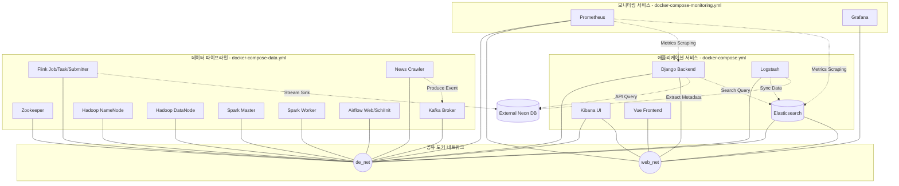

# 🚀 프로젝트 시작 가이드 (Getting Started Guide)

이 프로젝트는 **애플리케이션 서비스 영역**, **데이터 파이프라인 영역**, 그리고 **모니터링 영역**이 독립적인 Docker Compose 환경으로 분리되어 있습니다. 본 문서는 로컬 개발 환경을 설정하고 프로젝트를 시작하는 방법을 안내합니다.

---

## 📌 아키텍처 개요

프로젝트는 공유 네트워크(`de_net`, `web_net`)를 매개체로 하여 각 영역의 서비스들이 안전하게 협력하도록 구성되어 있습니다.



---

## 🛠️ 사전 요구사항 (Prerequisites)

시작하기 전 로컬 환경에 아래 도구들이 설치되어 있어야 합니다.

1. **Docker Desktop** (또는 Docker Engine 20.10+)
2. **Docker Compose v2** (최신 빌드 권장)
3. **Bash Shell** (Windows의 경우 Git Bash, WSL2 또는 PowerShell/Command Prompt 환경에서 실행 권한 지원 쉘 사용 가능)

---

## 🚦 서비스 실행 안내 (Execution Guide)

데이터베이스가 외부(Neon DB)에 있고, 필수 공통 인프라인 **Elasticsearch가 애플리케이션 컴포즈(`docker-compose.yml`)로 이전**되었기 때문에, **두 쉘 스크립트 구동 순서를 엄격하게 지킬 필요가 없으며 필요한 영역만 독립적으로 실행할 수 있습니다.**

### 1. 웹 서비스 영역 구동 (선택)
Django API 서버와 Vue.js 프론트엔드 환경을 가동합니다.
```bash
./service.sh up
```
> [!NOTE]
> 이 스크립트는 이미지를 빌드하고 `docker-compose.yml`에 설정된 `elasticsearch`, `kibana`를 먼저 띄운 다음 백엔드(`backend`) 서비스가 완전히 준비(Healthy)될 때까지 대기합니다. 이후 자동으로 Django Database Migration을 적용합니다.

### 2. 데이터 파이프라인 영역 구동 (선택)
데이터 수집, 가공, 스트리밍 파이프라인을 띄웁니다.
```bash
./data.sh up
```
> [!NOTE]
> 이 스크립트는 애플리케이션 서비스 컴포즈(`docker-compose.yml`)에 위치한 공통 검색 엔진(`elasticsearch`)이 구동되어 있지 않으면, 이를 자동으로 먼저 호출하여 구동한 뒤 파이프라인 서비스를 실행합니다. 그 후 Kafka 및 Hadoop 디렉토리를 초기화하고 기초 CSV 데이터를 로드합니다.

### 3. 시스템 모니터링 구동 (선택)
Prometheus와 Grafana를 구동하여 서비스 및 인프라의 상태를 모니터링합니다.
```bash
./monitoring.sh up
```

---

## 🌐 서비스 포트 및 UI 주소 정보

각 서비스가 정상적으로 실행되면 브라우저에서 아래 주소로 접속할 수 있습니다.

| 영역 | 서비스명 | 접속 URL | 용도 / 특징 |
| :--- | :--- | :--- | :--- |
| **애플리케이션** | Frontend | [http://localhost:5173](http://localhost:5173) | Vue.js 사용자 웹 인터페이스 |
| | Backend API | [http://localhost:8000](http://localhost:8000) | Django REST API 서버 |
| **핵심 인프라** | Kibana | [http://localhost:5601](http://localhost:5601) | Elasticsearch 데이터 시각화 도구 |
| **데이터 파이프라인** | Airflow | [http://localhost:8081](http://localhost:8081) | 파이프라인 배치 스케줄러 (ID: `admin`/`admin`) |
| | Spark Master | [http://localhost:8080](http://localhost:8080) | 분산 데이터 처리 클러스터 UI |
| | Flink UI | [http://localhost:8082](http://localhost:8082) | 실시간 스트림 처리 클러스터 UI |
| | Hadoop HDFS | [http://localhost:9870](http://localhost:9870) | 분산 파일 시스템 웹 콘솔 |
| **모니터링** | Prometheus | [http://localhost:9090](http://localhost:9090) | 시스템 메트릭 수집 및 현황 모니터링 |
| | Grafana | [http://localhost:3000](http://localhost:3000) | 수집된 메트릭 시각화 대시보드 UI |

---

## ⚙️ 상세 스크립트 설명

### 1. `service.sh`
*   **역할**: 애플리케이션 서비스 및 동기화/검색 인프라 기동 및 관리.
*   **사용법**: `sh service.sh {up|down|logs}`
*   **핵심 동작**:
    1. `.env` 파일 존재 여부 확인 (없으면 `.env.example` 복사본 생성)
    2. `up` 실행 시 `docker-compose.yml` 리소스를 통한 이미지 빌드
    3. `elasticsearch`, `kibana` 구동 후 백엔드(`backend`) 서비스가 준비될 때까지 대기
    4. `backend`, `frontend`, `logstash` 구동 완료 후 Django Migration 실행 (`manage.py migrate`)
    5. `down` 실행 시 컨테이너 종료, `logs` 실행 시 실시간 로그 추적

### 2. `data.sh`
*   **역할**: 분산 메시지 큐, 분산 스토리지, 분산 분석 엔진, 데이터 파이프라인 기동 및 관리.
*   **사용법**: `sh data.sh {up|down|logs}`
*   **핵심 동작**:
    1. 외부 도커 네트워크 `de_net`, `web_net` 생성 여부 검사 및 미존재 시 자동 생성
    2. `DB_HOST`가 로컬인 경우에만 로컬 데이터베이스 헬스 체크 실행 (외부 DB인 경우 체크 생략)
    3. `docker-compose.yml`에 들어있는 공통 `elasticsearch` 컨테이너의 작동 여부를 검사하고 미구동 시 자동 선기동
    4. `zookeeper`, `kafka`, `namenode`, `datanode` 1차 기동 후 Airflow, Spark, Flink, News-crawler 2차 기동
    5. `news-crawler`를 이용한 기초 Glossary DB 데이터 로드 및 HDFS 디렉토리 `/raw/bonds`, `/raw/news` 초기화
    6. `down` 실행 시 파이프라인 종료, `logs` 실행 시 로그 조회

### 3. `monitoring.sh`
*   **역할**: 모니터링 도구(Prometheus, Grafana)의 기동 및 관리.
*   **사용법**: `sh monitoring.sh {up|down|logs}`
*   **핵심 동작**:
    1. 외부 도커 네트워크 `de_net`, `web_net` 생성 여부 검사 및 미존재 시 자동 생성
    2. `up` 실행 시 Prometheus와 Grafana 서비스를 백그라운드로 실행
    3. `down` 실행 시 모니터링 서비스 종료, `logs` 실행 시 로그 조회

---

## 🚨 문제 해결 가이드 (Troubleshooting)

### Q1. 서비스(Backend, Frontend) 없이 데이터 파이프라인만 실행할 수 있나요?
> [!TIP]
> 네, 가능합니다. `./data.sh up`을 단독 실행하면, `docker-compose.yml`에 위치한 필수 공통 인프라인 `elasticsearch`가 구동되어 있지 않은 경우 자동으로 이를 먼저 실행한 뒤 파이프라인 서비스를 구동합니다. 이 경우 Django 백엔드와 Vue 프론트엔드 웹 서비스는 가동되지 않으므로 시스템 리소스를 크게 절약할 수 있습니다.

### Q2. 도커 네트워크 충돌이나 `external network ... not found` 에러가 납니다.
> [!TIP]
> 각 스크립트 실행 시 네트워크를 자동으로 생성하도록 구현되어 있으나, 수동으로 해결하고 싶다면 아래 명령어를 입력하십시오.
> ```bash
> docker network create de_net
> docker network create web_net
> ```

### Q3. 로컬 환경을 완전히 초기화하고 처음부터 다시 시작하고 싶습니다.
볼륨 데이터를 포함하여 모든 컨테이너를 내린 후 재기동하려면 아래 명령어를 순서대로 실행하십시오.
```bash
# 1. 쉘 스크립트를 사용하여 모든 서비스 종료
./service.sh down
./data.sh down
./monitoring.sh down

# 2. 처음부터 다시 실행
./service.sh up
# 완료 후 다른 터미널에서
./data.sh up
```

### Q4. 컨테이너 모니터링 및 디버깅은 어떻게 하나요?
자주 사용하는 Docker 디버깅 명령어 목록입니다. 각 목적에 맞추어 명령어를 활용하십시오.

#### 1. 컨테이너의 실시간 로그 확인하기
특정 컨테이너나 전체 서비스의 로그를 조회하고 추적(Stream)합니다.
```bash
# 스크립트를 사용하여 실시간 로그 확인
./service.sh logs
./data.sh logs
./monitoring.sh logs

# 특정 컨테이너 로그만 확인 (예: django-backend)
docker logs -f django-backend
```

#### 2. 컨테이너 내부로 들어가서 CLI(Shell)로 직접 명령 입력하기
컨테이너 내부 파일 상태나 환경 변수를 확인하기 위해 대화형 쉘(`bash` 또는 `sh`)로 접속합니다.
```bash
# bash가 설치된 컨테이너에 접속 (예: django-backend)
docker exec -it django-backend bash
```

#### 3. 컨테이너 내부에서 단일 명령어(Exec) 실행하기
컨테이너 내부로 쉘 접속을 하지 않고, 외부 호스트에서 내부 특정 명령어만 단발성으로 처리합니다.
```bash
# 형식: docker exec -it <컨테이너_이름> <명령어>
# 예: django-backend 컨테이너에서 Django database migration 상태 확인
docker exec -it django-backend python manage.py showmigrations
```

#### 4. 특정 컨테이너 재시작하기
전체 서비스를 내리지 않고, 설정 변경이나 오작동으로 인해 특정 컨테이너 하나만 다시 띄우고 싶을 때 사용합니다.
```bash
# docker compose를 사용한 재시작 (예: backend 서비스 재시작)
docker compose -f docker-compose.yml restart backend
```
