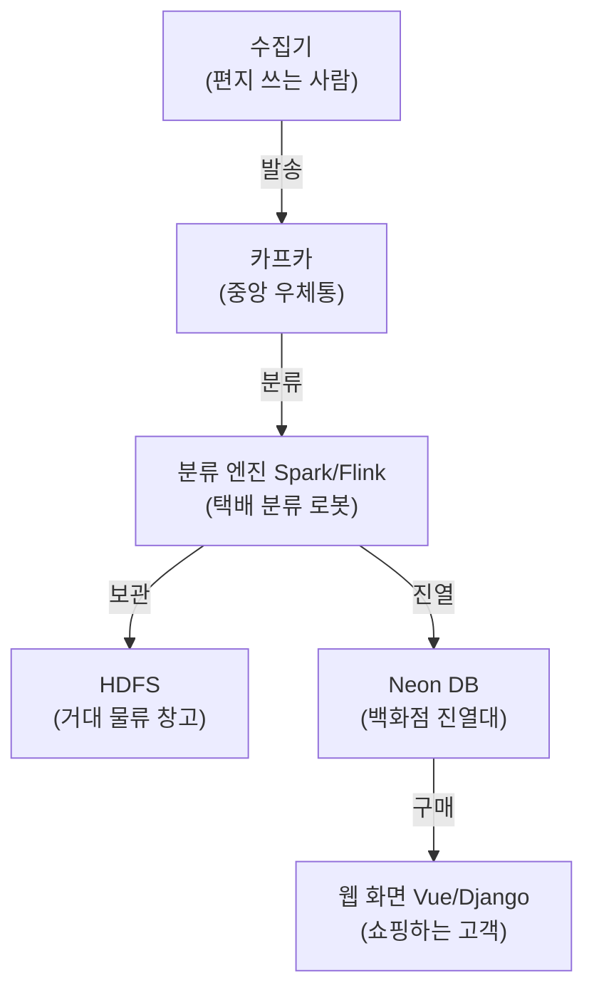

# 🚚 누구나 쉽게 이해하는 채권 & 뉴스 데이터 배송 파이프라인 가이드

이 문서는 우리 프로젝트(**de_pjt**)의 복잡한 데이터 파이프라인(배송 구조)을 전문 용어 대신 **일상생활의 비유**로 아주 쉽게 풀어쓴 설명서입니다. 개발자가 아닌 사람이나 프로젝트를 처음 접하는 팀원에게 이 가이드를 전달하면 구조를 5분 만에 이해할 수 있습니다.

---

## 🌟 1. 이 프로젝트는 무엇을 하나요?

개인 투자자가 채권을 사려고 할 때 필요한 정보(채권 기본 스펙, 이자 주기, 회사 신용 등급, 실시간 관련 뉴스, 어려운 금융 용어 사전)는 인터넷 여기저기에 흩어져 있습니다. 

우리 서비스는 **이 흩어진 정보들을 매일 자동으로 수집하고 정리해서 사용자가 한눈에 볼 수 있도록 모아주는 "스마트 정보 포털"**입니다.

---

## 📦 2. 전체 흐름을 일상에 비유해 볼까요?

데이터가 수집되어 화면에 나오기까지의 과정은 **"우체국 및 택배 배송 시스템"**과 똑같습니다.

### ① 뉴스 수집 흐름: "실시간 신문 속보 배달"
1. **뉴스 수집기(크롤러)**가 실시간으로 네이버나 연합인포맥스에서 채권 뉴스 기사를 긁어옵니다. (편지 쓰기)
2. 긁어온 뉴스 원본을 일단 **카프카(중앙 우체통)**에 쑤셔 넣습니다.
3. 실시간 분류 엔진인 **Flink(분류 로봇)**가 우체통을 지켜보고 있다가 뉴스를 쏙 빼옵니다.
4. Flink는 이 뉴스를 원본 파일 형태로 **HDFS(거대 물류 창고)**에 저장하고, 동시에 화면에 바로 노출될 수 있도록 **Neon DB(백화점 진열대)**에 실시간으로 올려놓습니다.

### ② 채권 수집 흐름: "하루 한 번 우편물 대량 일괄 배송"
1. 하루 한 번, 공공기관 API로부터 수만 건의 채권 정보들을 덤프트럭 단위로 수집합니다.
2. 수집된 데이터를 **카프카(중앙 우체통)**를 거쳐 **HDFS(거대 물류 창고)**에 고스란히 저장해 둡니다.
3. 대용량 정리 엔진인 **Spark(대형 분류 로봇)**가 밤사이에 창고에 있는 원본 파일들을 읽어와서 중복된 데이터를 지우고 깔끔하게 다듬습니다.
4. 정리가 끝난 깨끗한 채권 정보를 **Neon DB(백화점 진열대)**에 채워 넣습니다.

---

## 🛠️ 3. 핵심 부품들의 쉬운 역할 정리

* 📬 **카프카 (Kafka)**: **"완충 역할을 하는 24시간 우체통"**
  * 데이터를 임시로 보관해 주는 곳입니다. 만약 뒤에 있는 분류 로봇이나 데이터베이스가 잠시 고장 나서 작동을 멈춰도, 카프카가 편지들을 안전하게 모아두고 기다려 주기 때문에 **데이터 유실(분실)이 전혀 일어나지 않습니다.**
* 🤖 **플링크 (Flink) & 스파크 (Spark)**: **"데이터 정리 및 가공 로봇"**
  * **Flink (실시간 로봇)**: 뉴스가 들어오자마자 1초 만에 바로 분류해서 DB에 넣어주는 신속한 실시간 로봇입니다.
  * **Spark (대형 정리 로봇)**: 대용량 데이터를 정밀 처리하는 고성능 로봇입니다. **스스로 데이터를 저장하는 방이 없기 때문에, HDFS 창고의 '원자재 방(raw)'에서 대용량 데이터를 꺼내와 씻고 다듬은 뒤(메모리 가공), 다시 HDFS 창고의 '완제품 방(dw)'에 이쁘게 보관하는 역할**을 합니다.
    * *두 얼굴의 스파크*: 우리 프로젝트에서 Spark는 카프카에서 데이터를 가져와 HDFS raw 방에 실시간 파일로 쌓아놓는 일(실시간 스트리밍)과, 하루 단위로 대량의 쌓인 파일을 한꺼번에 긁어모아 정밀 가공하는 일(배치)을 둘 다 훌륭히 수행하고 있습니다.
* 🏺 **하둡 HDFS**: **"영구 보존 보물창고"**
  * 용량이 무제한에 가까운 창고이며, 원천 데이터를 날짜별 파일 형태로 저장해 둡니다.
  * **💡 파티션(Partition) 보관법 (서류 캐비닛 인덱스)**: 모든 데이터를 하나의 상자에 집어던져 섞어놓지 않고, `bas_dt=20260622` 같이 **날짜별로 개별 폴더(서랍 칸)를 쪼개어 데이터를 분리 보관**합니다. 
    * *이점 1 (엄청난 속도)*: "6월 22일 데이터만 보여줘!" 할 때 다른 폴더는 무시하고 오직 6월 22일 폴더 서랍만 열어서 쏙 빼오므로 디스크 낭비가 없고 탐색 속도가 획기적으로 빠릅니다.
    * *이점 2 (원터치 청소)*: "30일 지난 오래된 데이터 지워!" 할 때 파일 내부를 어렵게 뒤질 필요 없이, 30일 전 날짜의 폴더 통째로 1초 만에 휴지통에 삭제해 버리면 끝납니다.
* 🏪 **Neon DB (데이터베이스)**: **"예쁜 진열대"**
  * 사용자가 모바일 앱이나 웹사이트 화면을 켰을 때, 가장 예쁘고 빠른 속도로 정보들을 조회할 수 있도록 표(Table) 형태로 데이터를 최종 정리하여 진열해 두는 공간입니다.

---

## 💡 4. 왜 이렇게 복잡하게 만들었을까요?

단순히 수집기에서 데이터베이스로 바로 쏘게 만들면 훨씬 쉽지만, 그렇게 하지 않은 이유가 있습니다.

1. **상호 영향 차단**: 백화점 진열대(DB)가 정기 점검으로 잠시 문을 닫아도, 신문 배달부(크롤러)는 쉬지 않고 우체통(카프카)에 신문을 계속 넣을 수 있습니다. 아무도 일터가 마비되지 않습니다.
2. **트래픽 방어**: 갑자기 실시간 뉴스가 분당 수만 건씩 쏟아져도 우체통(카프카)이 완충을 해주므로 진열대(DB)가 무너져 내리지 않고 안전합니다.
3. **영구적인 기록**: 원천 파일은 거대 창고(HDFS)에 영구 저장되므로, 훗날 통계 분석이 필요할 때 언제든 과거 데이터를 다시 꺼내어 분석할 수 있습니다.
