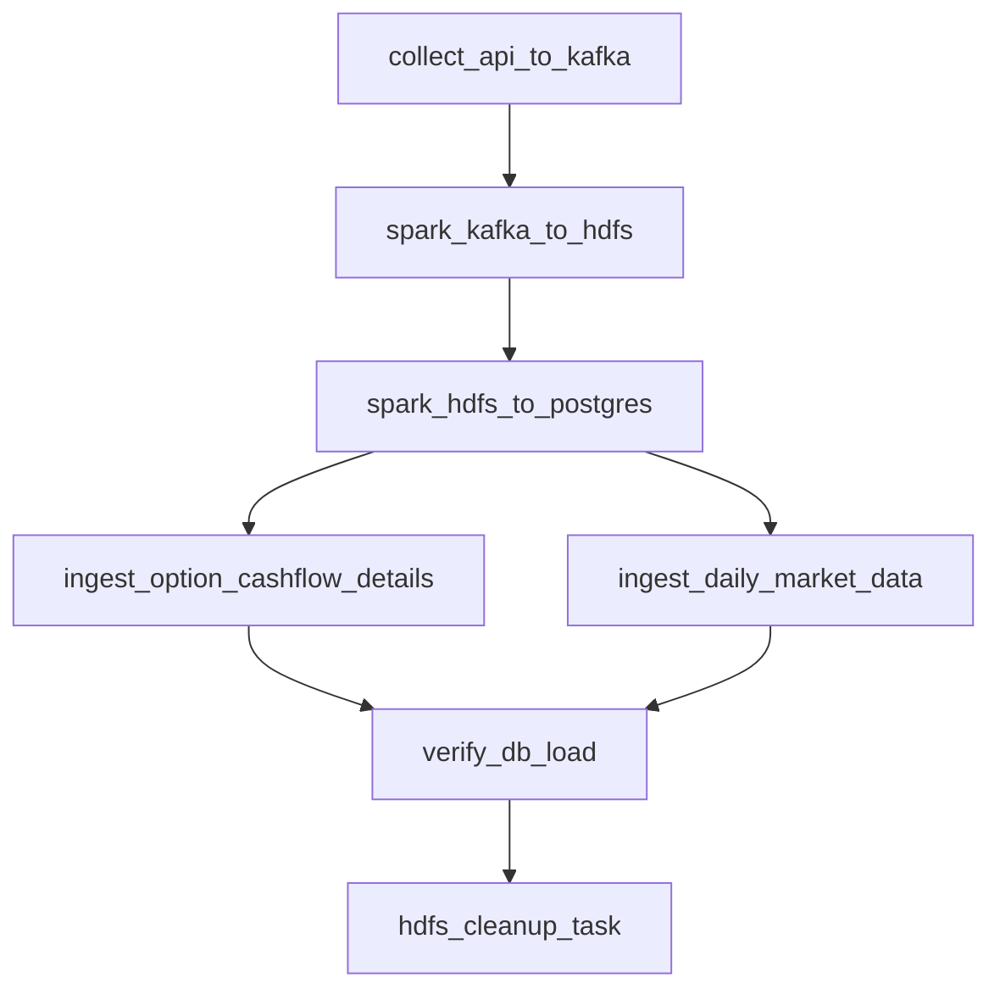
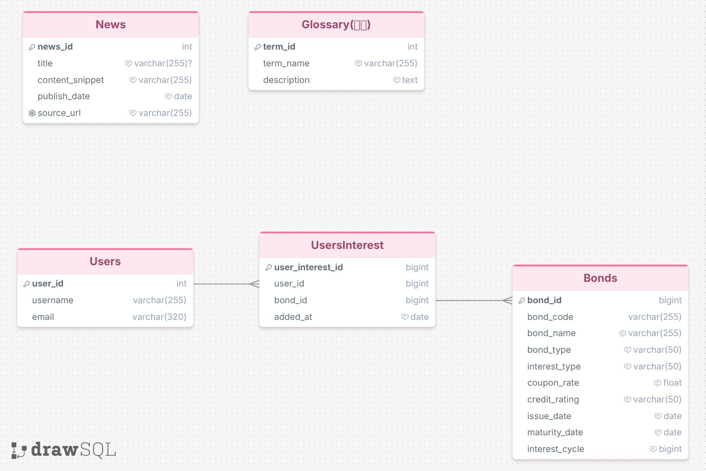
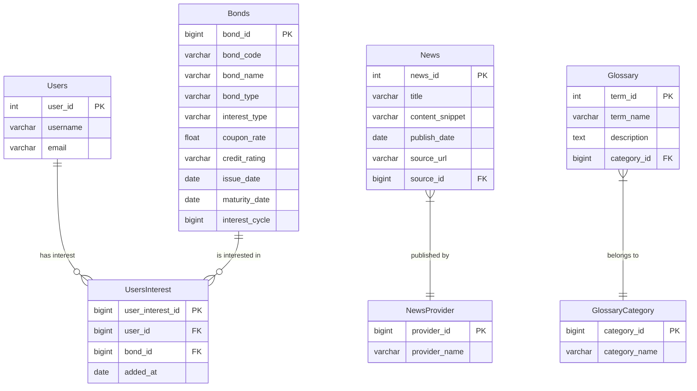

# 채권, 뉴스 및 용어 사전 데이터 파이프라인 요약 (최신 현황)

본 문서는 프로젝트(**de_pjt**)에 구축된 **채권 데이터베이스 정규화 구조**, **실시간 뉴스 및 HDFS/DB 듀얼 실시간 적재**, **HDFS 날짜별 파티셔닝 및 데이터 보존 정책**, 그리고 관련 **데이터 수집 파이프라인** 전체에 대한 최신 요약 보고서입니다.

---

## 1. 데이터 아키텍처 (Data Architecture)

전체 시스템의 데이터 흐름과 아키텍처 구성도입니다:


### [데이터 적재 흐름 요약]
1. **채권 배치 파이프라인 (Airflow & Spark)**
   * **API 수집**: `collect_api_to_kafka` 태스크가 공공데이터 API를 호출하여 Kafka 토픽(`topic_bond_raw`)으로 발행합니다.
   * **Raw 적재**: Spark Structured Streaming (`spark_kafka_to_hdfs`)이 작동하여 수집 날짜별로 HDFS raw 경로(`hdfs://namenode:9000/raw/bonds/bas_dt=YYYYMMDD/`)에 Parquet 포맷으로 실시간 적재합니다.
     * *고도화*: Spark Streaming 체크포인트를 HDFS 경로(`hdfs://namenode:9000/spark/checkpoints/kafka_to_hdfs`)로 내재화하여 데이터 유실 및 메타데이터 동기화 실패 문제를 원천 차단했습니다.
   * **DW 가공**: Spark Batch (`spark_hdfs_to_postgres`)가 raw Parquet 데이터를 읽어 정밀 가공 및 deduplication을 처리한 후, HDFS DW 경로(`hdfs://namenode:9000/dw/bonds/bas_dt=YYYYMMDD/`)에 최종 Parquet 형태로 아카이빙합니다.
   * **RDB 적재**: DW 데이터를 Neon DB PostgreSQL의 임시 staging 테이블(`temp_bonds_master_staging`)에 Overwrite한 뒤, 정규화 함수(`normalize_bonds_staging()`)를 실행하여 관계형 ERD 모델에 트랜잭션 안전하게 Upsert합니다.

2. **뉴스 스트리밍 파이프라인 (Flink & Trigger)**
   * **실시간 수집**: `news-crawler`가 네이버 금융 및 연합인포맥스를 주기적으로 스크랩하여 Kafka 토픽(`topic_news_raw`)으로 전송합니다.
   * **듀얼 적재 (DB & HDFS)**: PyFlink 스트리밍 잡(`news_processor.py`)이 기동되어 `StatementSet`을 통해 두 가지 싱크에 병렬로 데이터를 분산 적재합니다.
     * **Neon DB**: JDBC 커넥터로 staging 테이블(`news_article`)에 실시간 적재하며, 적재 완료 시 DB 트리거(`sync_news_article_to_erd()`)가 동작하여 `news_provider` 및 `news` 테이블로 자동 분기/정규화 적재합니다.
     * **HDFS**: 파일시스템 커넥터로 뉴스 원천 데이터를 날짜별 파티셔닝 구조(`hdfs://namenode:9000/raw/news/bas_dt=YYYYMMDD/`)로 JSON 포맷 실시간 보관합니다. 10초 주기의 Flink checkpoint를 활성화하여 트랜잭션 일관성을 가집니다.

3. **데이터 보존 정책 (Data Retention Policy)**
   * **자동 클린업**: Airflow DAG의 최종 단계인 `hdfs_cleanup_task`가 매일 구동됩니다.
   * **REST WebHDFS 연동**: Hadoop 클라이언트를 직접 설치할 필요 없이 WebHDFS API REST 호출을 활용해 `/raw/bonds`, `/dw/bonds`, `/raw/news` 내에서 **30일 이전 날짜를 가진 파티션 디렉토리를 탐색하고 자동으로 영구 삭제**하여 스토리지를 효율적으로 보호합니다.

---

## 1-B. HDFS 디렉토리 및 파일 구조 (HDFS Directory & File Structure)

HDFS 내에 구성된 원천 및 가공 데이터, 그리고 Spark 메타데이터를 저장하는 물리적인 트리 디렉토리 구조입니다.

```text
HDFS Root (/)
├── raw/                        # 1. 원천 데이터 영역
│   ├── bonds/                  # 채권 API 원본 데이터 (Parquet 포맷)
│   │   ├── _spark_metadata/    # Spark Structured Streaming 파일 상태 메타데이터
│   │   ├── bas_dt=20260621/    # 6월 21일 수집 채권 데이터 파티션
│   │   │   └── part-00000-5be35e85-e451...snappy.parquet (~18.9MB)
│   │   └── bas_dt=20260622/    # 6월 22일 수집 채권 데이터 파티션
│   │       └── part-00000-b69a93c6-8bb1...snappy.parquet (~28.4MB)
│   │
│   └── news/                   # 실시간 수집 뉴스 원본 데이터 (JSON 포맷)
│       └── bas_dt=20260622/    # Flink가 write_date에서 동적 추출한 오늘 자 뉴스 파티션
│           └── .part-4e38f188-f59d...inprogress... (실시간 유입 중인 데이터 쓰기 세션)
│
├── dw/                         # 2. 데이터 웨어하우스 (가공 및 적재용) 영역
│   └── bonds/                  # RDB 적재용으로 deduplication / 가공 완료된 데이터
│       ├── _SUCCESS            # 배치 최종 성공 플래그 메타 파일
│       └── bas_dt=20260621/    # 6월 21일 배치 처리된 정규화 데이터 파티션
│           ├── part-00000-06168b35-031c...snappy.parquet
│           ├── ...
│           └── part-00006-06168b35-031c...snappy.parquet
│
└── spark/                      # 3. Spark 시스템 메타데이터 영역
    └── checkpoints/            # Spark 스트리밍 유실 방지용 체크포인트
        └── kafka_to_hdfs/      # Kafka-to-HDFS 파이프라인의 상태 및 오프셋 관리
            ├── metadata        # 스트림 고유 메타데이터 파일
            ├── commits/        # Flink/Spark에 의해 처리 완료된 커밋 번호 목록 (0)
            ├── offsets/        # Kafka에서 마지막으로 처리한 토픽 오프셋 정보 (0)
            └── sources/        # Source 원천 파일의 추적용 파일 상태 (0/0)
```

---

## 2. 데이터 수집 출처 및 오픈 API 명세 (Data Sources & API Specifications)

파이프라인에서 데이터를 수집하기 위해 활용한 공공데이터포털(data.go.kr) 및 외부 웹 사이트 정보입니다.

### ① 금융위원회_채권기본정보 (채권 마스터 데이터)
* **제공처**: 공공데이터포털 (`data.go.kr`) - 금융위원회
* **Base URL**: `http://apis.data.go.kr/1160100/GetBondIssuInfoService_V2/getBondBasiInfo_V2`
* **수집 데이터**: 채권 표준코드(`isinCd`), 채권명(`isinCdNm`), 발행일자(`bondIssuDt`), 만기일자(`bondExprDt`), 표면금리(`bondSrfcInrt`), 발행총액(`bondIssuAmt`), 우선순위(`bondRnknDcdNm`), 이자형태(`bondIntTcdNm`) 등

### ② 금융위원회_채권권리 상세정보 (이자지급 및 옵션 상세 조건)
* **제공처**: 공공데이터포털 (`data.go.kr`) - 금융위원회 및 한국예탁결제원 (KSD)
* **API 목록 및 상세 URL**:
  1. **금융위원회_채권권리일정정보 (핵심 연동)**:
     - URL: `http://apis.data.go.kr/1160100/GetBondRighScheInfoService_V2/getBondRighExerSche_V2`
     - 수집 데이터: 실제 채권 일정 기준일자(`basDt`)와 일정구분코드명(`scrsScedDcdNm`)을 파싱하여 이자지급일(원리금지급일) 및 조기상환일(콜/풋 옵션 행사 가능일)을 동적으로 추출합니다.
  2. **금융위원회_채권권리행사정보 (보조 연동)**:
     - URL: `http://apis.data.go.kr/1160100/GetBondRedeInfoService_V2/getEarlExerOpti_V2`
     - 수집 데이터: 실제 조기행사 옵션 시작일자(`optiExerStrtDt`), 옵션유형, 옵션행사금액 등
  3. **한국예탁결제원_채권정보서비스_GW (장애 대비 백업)**:
     - 이자지급 정보: `http://apis.data.go.kr/B552481/BondSvc/getBondIntrPayInfo`
     - 옵션 행사 정보: `http://apis.data.go.kr/B552481/BondSvc/getBondOptionInfo`

### ③ 금융위원회_채권시세정보 (일별 거래 시세)
* **제공처**: 공공데이터포털 (`data.go.kr`) - 금융위원회
* **Base URL**: `http://apis.data.go.kr/1160100/service/GetBondSecuritiesInfoService/getBondPriceInfo`
* **수집 데이터**: 단축코드(`srtnCd`), 단축종목명(`itmsNm`), 종가(`clprPrc`), 만기수익률(`clprBnfRt`), 거래량(`trqu`), 등락폭(`clprVs`) 등

### ④ 웹 뉴스 데이터 (실시간 뉴스 스트리밍)
* **제공처**: 네이버 금융 주요뉴스 및 연합인포맥스
* **수집 URL**: 
  * 네이버 금융 주요뉴스: `https://finance.naver.com/news/mainnews.naver`
  * 연합인포맥스 채권뉴스: `https://news.einfomax.co.kr`

### ⑤ 경제금융용어 800선 (용어 사전)
* **제공처**: 한국은행 공식 발간물 (`bok.or.kr`)
* **원본 파일**: `2026_한국은행_경제금융용어 800선.pdf`
* **수집 방식**: PDF 파싱(pdfplumber) 및 텍스트 정제

---

## 3. 데이터 파이프라인 흐름 및 구현 세부



### ① 채권 이자/옵션 조건 상세화 (`ingest_option_cashflow_details`)
* **점진적 적재 (Incremental Load)**: 마스터 테이블에 등록된 채권 중 상세 정보가 아직 채워지지 않은 채권(`first_interest_payment_date IS NULL`)을 조회하여 실행당 **최대 100건**씩 순차 적재합니다.
* **API Fallback 계산**: 공공데이터포털 API의 통신 장애나 누락 상황에 대비하여, 기존 채권 마스터 데이터(`issue_date`, `payment_cycle_months` 등)를 바탕으로 이자지급일 및 조기상환 가능 일정을 자동 계산하여 적재하는 Fallback 비즈니스 로직을 구축했습니다.

### ② 일별 시세 데이터 수집 (`ingest_daily_market_data`)
* **3일 탐색 윈도우**: 주말 및 공휴일 데이터 공백을 방지하기 위해 최근 3일치 데이터를 조회하도록 구성했습니다.
* **단축 정보 동적 업데이트**: 시세 정보 API에서 수신한 단축코드(`srtnCd`)와 단축명(`itmsNm`)을 `bond` 테이블의 `short_code`와 `short_name` 컬럼에 실시간으로 반영하며, 종가/수익률/거래량 데이터를 `bond_market_data` 테이블에 UPSERT 처리합니다.

### ③ 실시간 뉴스 HDFS/DB 듀얼 연동 (`news_processor.py`)
* PyFlink 스트림 프로세서가 Kafka 토픽을 구독하여 `StatementSet`을 활용해 관계형 DB(`news_article`) 및 HDFS 파일 시스템(`hdfs://namenode:9000/raw/news`)에 동시에 데이터를 병렬 적재합니다.
* 날짜 포맷 기호(점`.`과 하이픈`-`)를 전처리하여 항상 올바른 `YYYYMMDD` 파티셔닝 구조를 갖도록 동적 파싱 로직을 내장하였습니다.

### ④ HDFS 데이터 보존 정책 (`hdfs_cleanup_task`)
* Airflow 파이프라인의 최종 마감 단계로 실행되며, WebHDFS API REST 통신을 통해 HDFS 디렉토리 구조를 확인한 후 `bas_dt` 값이 당일 기준 **30일 이전**인 파티션들을 일괄 재귀 삭제합니다.

---

## 4. 전체 데이터베이스 테이블별 실시간 적재 현황

### ① 관계형 데이터베이스 ERD 다이어그램


#### 📝 Mermaid 텍스트 ERD (마크다운 백업 시각화)


### ② 테이블별 실시간 적재 현황
현재 데이터베이스(`bonds_db`) 내의 모든 관계형 테이블은 **소문자 및 스네이크 케이스(Snake Case)** 명명 규칙을 적용하여 안정적으로 적재가 완료되었습니다.

| 분류 | 테이블명 | 적재 건수 | 상태 및 목적 |
|---|---|---|---|
| **채권** | **`industry`** (산업 분류) | **169건** | 적재 완료 (발행기관이 속한 산업군 종류) |
| **채권** | **`issuer`** (발행기관) | **861건** | 적재 완료 (회사 및 기관 마스터 정보) |
| **채권** | **`bond_type`** (채권 종류) | **8건** | 적재 완료 (금융채, 일반회사채 등 시드 코드) |
| **채권** | **`seniority`** (우선순위) | **2건** | 적재 완료 (선순위, 후순위 구분 코드) |
| **채권** | **`credit_rating`** (신용 등급) | **20건** | 적재 완료 (AAA ~ D 정렬 등급) |
| **채권** | **`guarantee_status`** (보증 여부) | **2건** | 적재 완료 (보증, 무보증 시드 코드) |
| **채권** | **`bond_cashflow_rule`** (이자지급조건) | **29,021건** | 적재 완료 (채권별 상세 지급 일정 조건) |
| **채권** | **`bond_option_exercise`** (옵션행사정보) | **29,021건** | 적재 완료 (채권별 조기상환 행사 기간 정보) |
| **채권** | **`bond`** (채권 마스터) | **29,021건** | 적재 완료 (수집 완료된 채권 기본 정보 전체) |
| **사용자** | **`users`** (서비스 사용자) | **0건** | 서비스 단계 데이터 |
| **사용자** | **`user_bond`** (포트폴리오) | **0건** | 가상 매수 포트폴리오 데이터 |
| **시세** | **`bond_market_data`** (시장 종가 시세) | **10건** | 적재 완료 (일별 시세 및 만기수익률 등) |
| **뉴스** | **`news_provider`** (언론사 목록) | **25건** | 적재 완료 (뉴스 출처 언론사 목록) |
| **뉴스** | **`news`** (뉴스 본문) | **168건** | 적재 완료 (Staging 적재 시 트리거를 통해 정규화 완료) |
| **용어** | **`glossary_category`** (용어 분류) | **7건** | 적재 완료 (금융 용어 사전 카테고리) |
| **용어** | **`glossary`** (금융 용어 사전) | **684건** | 적재 완료 (한국은행 800선 정제 데이터 적재 완료) |
| **Staging** | **`news_article`** (임시 적재) | **168건** | 적재 완료 (Flink 실시간 스트리밍 임시 수집처) |

---

## 5. 테이블별 컬럼 정의 및 스키마 구조

### [채권 영역 스키마]

#### ① industry (산업 분류)
* `industry_id` (PK, BIGINT) - 산업군 일련번호
* `industry_name` (VARCHAR(50)) - 산업 분류명 (예: 개발금융기관)
* `created_at` / `updated_at` / `deleted_at`

#### ② issuer (발행기관)
* `issuer_id` (PK, BIGINT) - 발행인 일련번호
* `industry_id` (FK, BIGINT) - 산업군 ID
* `issuer_name` (VARCHAR(100)) - 회사명/기관명
* `crno` (VARCHAR(50)) - 법인등록번호 (Unique)
* `created_at` / `updated_at` / `deleted_at`

#### ③ bond_type (채권 종류)
* `bond_type_id` (PK, BIGINT)
* `bond_type` (VARCHAR(100)) - 채권 종류명

#### ④ seniority (우선순위)
* `seniority_id` (PK, BIGINT)
* `seniority_name` (VARCHAR(20)) - 우선순위 구분 (선순위 / 후순위)
* `priority_order` (BIGINT) - 우선순위 정렬 순서

#### ⑤ credit_rating (신용 등급)
* `rating_id` (PK, BIGINT)
* `rating_name` (VARCHAR(30)) - 신용 등급 코드
* `rating_order` (BIGINT) - 등급 순서 (낮을수록 우량)

#### ⑥ guarantee_status (보증 여부)
* `guarantee_status_id` (PK, BIGINT)
* `guarantee_status` (VARCHAR(10)) - 보증 여부 (보증 / 무보증)

#### ⑦ bond_cashflow_rule (이자지급조건 상세)
* `cashflow_rule_id` (PK, BIGINT)
* `interest_payment_method` (VARCHAR(255)) - 이자 지급 상세 방법
* `interest_payment_unit_months` (VARCHAR(255)) - 이자 지급 주기 (예: 3개월)
* `interest_calculation_months` (VARCHAR(255)) - 이자 계산 방식
* `interest_pre_post_type` (VARCHAR(255)) - 이자 선/후급 구분 (선급 / 후급)
* `first_interest_payment_date` (DATE) - 최초 이자 지급일자
* `interest_payment_basis` (VARCHAR(255)) - 이자 지급 기준
* `interest_month_end_type` (VARCHAR(255)) - 이자 월말 구분

#### ⑧ bond_option_exercise (옵션 행사 가능일 상세)
* `option_exercise_id` (PK, BIGINT)
* `option_type` (VARCHAR(50)) - 옵션 유형 (CALL, PUT, CALL+PUT, 옵션해당사항없음)
* `exercise_start_date_1` (DATE) - 1차 옵션 행사 시작일
* `exercise_end_date_1` (DATE) - 1차 옵션 행사 종료일
* `exercise_start_date_2` (DATE) - 2차 옵션 행사 시작일
* `exercise_end_date_2` (DATE) - 2차 옵션 행사 종료일
* `exercise_reason` (TEXT) - 옵션 행사 사유/특이사항 설명

#### ⑨ bond (채권 마스터)
* `bond_id` (PK, BIGINT) - 채권 마스터 일련번호
* `isin_code` (VARCHAR(255)) - 국제표준코드 (ISIN, Unique)
* `bond_type_id` (FK, BIGINT) - 채권 종류 ID
* `short_code` (VARCHAR(255)) - 채권 단축코드
* `bond_name` (VARCHAR(255)) - 표준 채권명
* `short_name` (VARCHAR(255)) - 단축 채권명
* `issuer_id` (FK, BIGINT) - 발행기관 ID
* `issue_date` (DATE) - 채권 발행일
* `maturity_date` (DATE) - 채권 만기일
* `coupon_rate` (DECIMAL(10, 4)) - 표면이율 (이표금리)
* `issue_amount` (BIGINT) - 총 발행 금액
* `underwriter` (VARCHAR(255)) - 인수 주선인
* `option_type` (VARCHAR(50)) - 옵션 유형
* `cashflow_rule_id` (FK, BIGINT) - 이자지급조건 ID
* `interest_type` (VARCHAR(50)) - 이자 유형 (이표채, 복리채, 단리채, 할인채)
* `payment_cycle_months` (INT) - 이자 지급 주기 (월 수)
* `maturity_redemption_rate` (DECIMAL(15, 2)) - 만기 상환율
* `redemption_method` (VARCHAR(255)) - 상환 방식
* `early_redemption_description` (TEXT) - 조기상환 특이사항 상세
* `seniority_id` (FK, BIGINT) - 우선순위 ID
* `option_exercise_id` (FK, BIGINT) - 옵션행사정보 ID
* `guarantee_status_id` (FK, BIGINT) - 보증 여부 ID
* `rating_id` (FK, BIGINT) - 신용 등급 ID

#### ⑩ users (서비스 사용자)
* `user_id` (PK, BIGINT)
* `user_name` (VARCHAR(255)) - 사용자 이름
* `user_email` (VARCHAR(255)) - 이메일 주소

#### ⑪ user_bond (사용자 채권 가상 구매 포트폴리오)
* `user_bond_id` (PK, BIGINT)
* `user_id` (FK, BIGINT) - 사용자 ID
* `bond_id` (FK, BIGINT) - 구매한 채권 ID
* `purchase_price` (DECIMAL(15, 2)) - 가상 구매 단가
* `purchase_date` (DATETIME) - 가상 구매 일시
* `quantity` (BIGINT) - 구매 수량

#### ⑫ bond_market_data (채권 시장 시세 정보)
* `market_data_id` (PK, BIGINT)
* `bond_id` (FK, BIGINT) - 대상 채권 ID
* `base_date` (DATE) - 시세 조회 기준 일자
* `price` (DECIMAL(15, 2)) - 당일 종가 (Closing Price)
* `ytm` (DECIMAL(8, 3)) - 만기수익률 (Yield to Maturity)
* `duration` (DECIMAL(8, 4)) - 듀레이션
* `spread` (DECIMAL(8, 7)) - 스프레드
* `trading_volume` (BIGINT) - 당일 거래량
* `substitute_price` (VARCHAR(255)) - 대용가격
* `bid_yield` (VARCHAR(255)) - 매수수익률
* `ask_yield` (VARCHAR(255)) - 매도수익률
* `price_change_rate` (VARCHAR(255)) - 전일 대비 등락폭/등락률

---

### [뉴스 및 용어 사전 영역 스키마]

#### ⑬ news_provider (뉴스 제공 언론사)
* `provider_id` (PK, BIGINT) - 언론사 일련번호
* `provider_name` (VARCHAR(50)) - 언론사명 (Unique, 예: 연합인포맥스)

#### ⑭ news (뉴스 기사 본문)
* `news_id` (PK, BIGINT) - 기사 일련번호
* `source_id` (FK, BIGINT) - 제공 언론사 ID
* `title` (VARCHAR(255)) - 기사 제목
* `url` (VARCHAR(255)) - 기사 원문 URL (Unique)
* `summary` (TEXT) - 기사 요약 내용
* `published_at` (DATETIME) - 기사 작성 일시

#### ⑮ glossary_category (용어 사전 분류)
* `category_id` (PK, BIGINT) - 분류 카테고리 일련번호
* `category_name` (VARCHAR(50)) - 카테고리명 (Unique)

#### ⑯ glossary (금융 용어 사전)
* `term_id` (PK, BIGINT) - 용어 일련번호
* `category_id` (FK, BIGINT) - 분류 카테고리 ID
* `term_name` (VARCHAR(255)) - 용어명
* `difficulty` (VARCHAR(50)) - 난이도 분류 (입문, 기초, 중요, 심화)
* `description` (TEXT) - 용어 정의 상세 설명문
* `example_text` (TEXT) - 예문/해설

#### ⑰ news_article (Flink 수집용 임시 Staging)
* `id` (PK, SERIAL) - 수집 일련번호
* `title` (VARCHAR(500)) - 기사 제목
* `source` (VARCHAR(100)) - 크롤러 수집 소스명
* `url` (VARCHAR(500)) - 수집 원본 URL (Unique)
* `write_date` (DATETIME) - 기사 작성일

---

## 6. PostgreSQL 데이터 적재 검증 명령어 가이드

데이터 파이프라인 실행 후 PostgreSQL 데이터베이스(`bonds_db`)에 테이블별 데이터가 안정적으로 적재되었는지 검증하기 위한 CLI 및 SQL 명령어 세트입니다.

### ① PostgreSQL 컨테이너 접속 (psql CLI)
```bash
docker exec -it postgres psql -U ssafyuser -d bonds_db
```

### ② 전체 테이블 데이터 건수 확인 (요약용)
```sql
SELECT
    (SELECT COUNT(*) FROM bond) AS bond_count,
    (SELECT COUNT(*) FROM bond_cashflow_rule) AS cashflow_rule_count,
    (SELECT COUNT(*) FROM bond_option_exercise) AS option_exercise_count,
    (SELECT COUNT(*) FROM bond_market_data) AS market_data_count,
    (SELECT COUNT(*) FROM news) AS news_count,
    (SELECT COUNT(*) FROM glossary) AS glossary_count,
    (SELECT COUNT(*) FROM issuer) AS issuer_count,
    (SELECT COUNT(*) FROM industry) AS industry_count;
```

### ③ 실제 최초 이자지급일(Coupon) 데이터 검증
```sql
SELECT b.isin_code, b.bond_name, c.interest_payment_method, c.first_interest_payment_date, c.interest_payment_unit_months
FROM bond b
JOIN bond_cashflow_rule c ON b.cashflow_rule_id = c.cashflow_rule_id
WHERE c.first_interest_payment_date IS NOT NULL
LIMIT 5;
```

### ④ 실제 옵션 권리 행사일(조기상환일) 데이터 검증
```sql
SELECT b.isin_code, b.bond_name, b.option_type, o.exercise_start_date_1, o.exercise_end_date_1, o.exercise_reason
FROM bond b
JOIN bond_option_exercise o ON b.option_exercise_id = o.option_exercise_id
WHERE o.exercise_start_date_1 IS NOT NULL AND b.option_type != '옵션해당사항없음'
LIMIT 5;
```

### ⑤ 실시간 수집 뉴스 및 정규화 동적 트리거 검증
```sql
SELECT n.news_id, p.provider_name, n.title, n.published_at
FROM news n
JOIN news_provider p ON n.source_id = p.provider_id
ORDER BY n.published_at DESC
LIMIT 5;
```