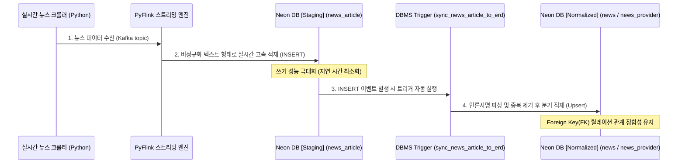

# 🛠️ [Troubleshooting] HDFS 적재 흐름 및 Neon DB Staging vs Normalized 아키텍처 분석

본 문서는 프로젝트(**de_pjt**) 수행 중 데이터 아키텍처 상의 데이터 적재 위치(HDFS vs Neon DB) 및 실시간 스트리밍(Flink) 처리 시 Staging 영역과 Normalized 영역의 아키텍처적 차이점과 역할을 명확히 정리한 트러블슈팅 및 아키텍처 가이드입니다.

---

## 🔍 1. 의문점 및 문제 제기 (Context)

프로젝트 아키텍처 설계 및 데이터 파이프라인 흐름을 검토하는 과정에서 다음 두 가지 의문이 발생하였습니다.

1. **물리적 저장 위치의 모호성**: "하둡(HDFS)에서 Neon DB Staging을 수행할 때, 최종 데이터는 하둡에 저장되는가, 아니면 Neon DB에 저장되는가?"
2. **Flink 파이프라인 내 이중 적재 의문**: "Neon DB 내에서 Staging 테이블(`news_article`)과 Normalized 테이블(`news`, `news_provider`)은 어떤 차이가 있으며, 왜 굳이 이중 구조로 나누어 적재하는가?"

---

## 💡 2. 개념 분석 및 아키텍처 검증 (Analysis)

### ① 하둡(HDFS) vs Neon DB의 역할 분담
* **하둡(HDFS)의 역할**: API 또는 웹 크롤러가 수집한 대용량 Raw/DW 데이터를 파일 포맷(Parquet, JSON) 단위로 장기 보존하는 **스토리지(Storage) 영역**입니다.
* **Neon DB (PostgreSQL)의 역할**: 최종 사용자가 웹 서비스나 대시보드 상에서 지연(Latency) 없이 쿼리할 수 있도록 스키마가 잡힌 상태로 저장하는 **관계형 데이터베이스(RDB) 영역**입니다.
* **적재 흐름**: Spark Batch나 Flink가 하둡(HDFS) 및 Kafka에서 데이터를 가져와 **Neon DB에 위치한 Staging 테이블로 쿼리를 실행하여 물리적으로 적재**합니다. 즉, 데이터의 최종 서비스 대상지는 Neon DB입니다.

### ② Neon DB Staging vs Normalized Schema 비교

| 구분 | Staging 영역 (`news_article`) | Normalized 영역 (`news`, `news_provider`) |
| :--- | :--- | :--- |
| **물리적 위치** | Neon DB (PostgreSQL) 내부 | Neon DB (PostgreSQL) 내부 |
| **데이터 구조** | 비정규화 (Flat Table) | 정규화 (ERD 릴레이션 관계 구축) |
| **적재 주체** | PyFlink 스트리밍 잡 (직접 Write) | Neon DB 내부의 DBMS 트리거 (자동 이관) |
| **최적화 목적** | **쓰기(Write) 성능 최적화** (지연 없는 인서트) | **읽기(Read) 성능 및 데이터 일관성 최적화** |

---

## 🛠️ 3. 상세 데이터 흐름도 (Data Flow)

실시간 뉴스 스트리밍 파이프라인의 데이터 적재 흐름을 나타낸 구조도입니다.

---

## 🌟 4. 이중 아키텍처(Staging ➡️ Normalized)의 설계 이점

1. **실시간 스트리밍 쓰기(Write) 병목 해소**
   * Flink 애플리케이션 내에서 DB의 조인 연산이나 외래키 정합성, 언론사 중복 체크(SELECT 후 INSERT 등)를 매번 수행하려면 네트워크 라운드트립과 연산 부하로 인해 실시간 뉴스 유입 속도를 따라가지 못합니다.
   * Flink는 단순히 쓰기 전용 단일 테이블(Staging)에 밀어 넣기만 하고 즉시 다음 태스크를 처리하므로 병목이 발생하지 않습니다.

2. **데이터 처리 로직의 분리 (Decoupling)**
   * 애플리케이션 영역(Flink Python 코드)과 데이터베이스 저장소 영역(PostgreSQL 트리거)의 책임을 명확히 분리하여 파이프라인 소스 코드의 가독성과 유지보수성이 크게 향상됩니다.

3. **장애 발생 시 복구 유연성 (Fault Tolerance)**
   * 정규화 처리 트리거 오류가 발생하더라도 Flink는 Staging 테이블에 원본 데이터를 계속 유실 없이 적재할 수 있으며, 사후에 DB 내의 Staging 로그를 조회하여 유실 없이 복구(Replay)할 수 있습니다.

---

## 📝 5. 작성 및 적용 가이드
* 본 아키텍처 구조는 [pipeline_ingestion_summary.md](file:///C:/Users/SSAFY/Desktop/de_pjt/pipeline_ingestion_summary.md)의 **4. 전체 데이터베이스 테이블별 실시간 적재 현황** 및 **5. 테이블 스키마 구조** 설계 원칙과 완벽하게 일치합니다.
* 트러블슈팅 시, Flink가 DB에 데이터를 넣고 있는지 검증하려면 Staging 테이블(`news_article`)의 Row Count와 Normalized 테이블(`news`)의 Row Count가 일치하는지 모니터링해야 합니다.
