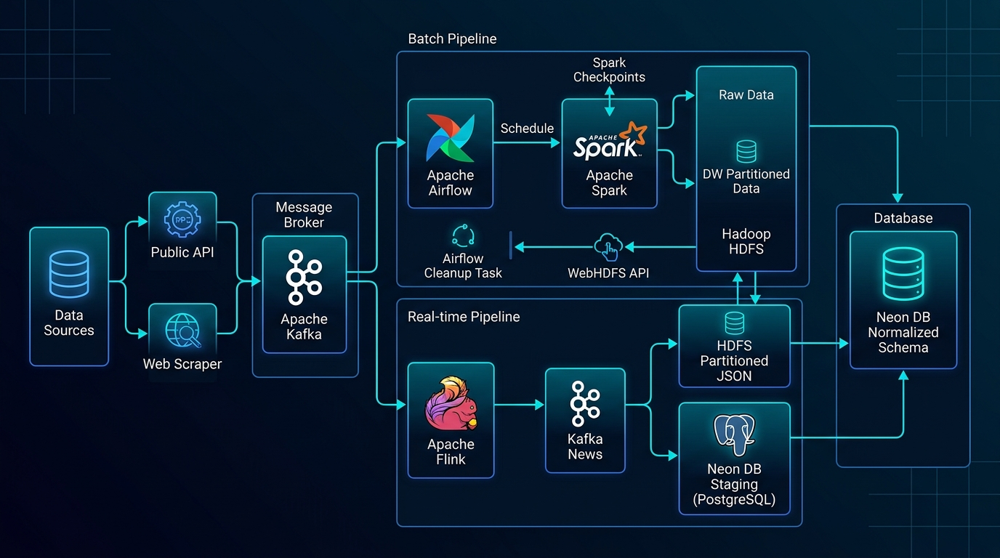
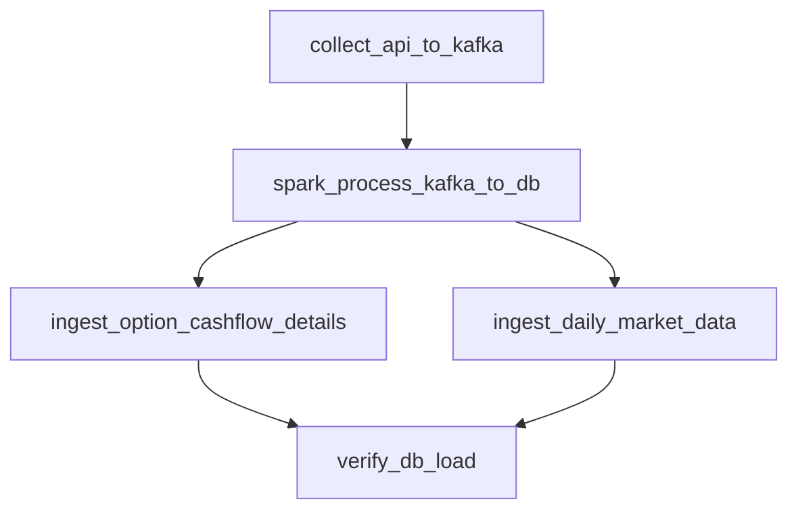
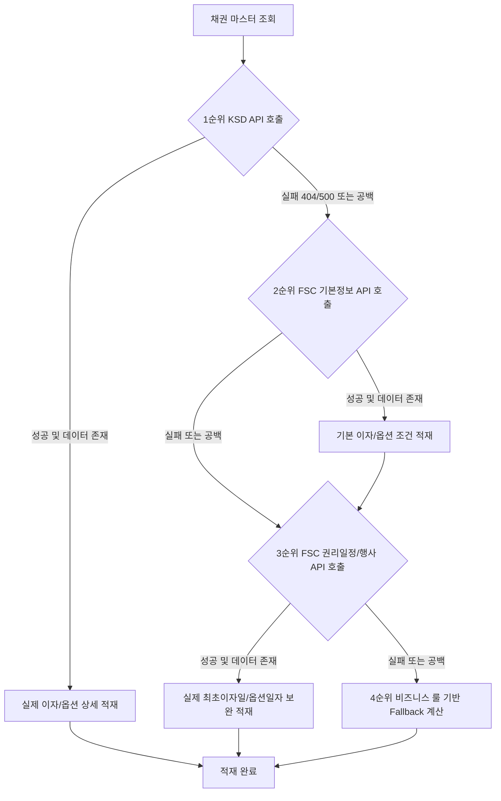

# 채권, 뉴스 및 용어 사전 데이터 파이프라인 요약

본 문서는 프로젝트(**de_pjt**)에 구축된 **채권 데이터베이스 정규화 구조**, **실시간 뉴스 및 경제 용어 사전 데이터베이스**, 그리고 관련 **데이터 수집 파이프라인** 전체에 대한 요약 보고서입니다.

---

## 1. 데이터 아키텍처 (Data Architecture)

전체 시스템의 데이터 흐름과 아키텍처 구성도입니다:


---
## 2. 데이터 수집 출처 및 오픈 API 명세 (Data Sources & API Specifications)

파이프라인에서 데이터를 수집하기 위해 활용한 공공데이터포털(data.go.kr) 및 외부 웹 사이트 정보입니다.

### ① 금융위원회_채권기본정보 (채권 마스터 데이터)
* **제공처**: 공공데이터포털 (`data.go.kr`) - 금융위원회
* **Base URL**: `http://apis.data.go.kr/1160100/GetBondIssuInfoService_V2/getBondBasiInfo_V2`
* **요청 파라미터**: `serviceKey`, `resultType=json`, `numOfRows`, `pageNo`
* **수집 데이터**: 채권 표준코드(`isinCd`), 채권명(`isinCdNm`), 발행일자(`bondIssuDt`), 만기일자(`bondExprDt`), 표면금리(`bondSrfcInrt`), 발행총액(`bondIssuAmt`), 우선순위(`bondRnknDcdNm`), 이자형태(`bondIntTcdNm`) 등

### ② 한국예탁결제원_채권정보서비스_GW 및 금융위원회 채권권리 상세정보 (이자지급 및 옵션 상세 조건)
* **제공처**: 공공데이터포털 (`data.go.kr`) - 한국예탁결제원 (KSD) 및 금융위원회 (FSC)
* **API 목록 및 상세 URL**:
  1. **한국예탁결제원_채권정보서비스_GW (기존/폐기)**:
     - 이자지급 정보: `http://apis.data.go.kr/B552481/BondSvc/getBondIntrPayInfo`
     - 옵션 행사 정보: `http://apis.data.go.kr/B552481/BondSvc/getBondOptionInfo`
     - *주의*: 해당 예탁결제원 API 서비스는 데이터 관리 체계 변경(2026년 3월)으로 인해 호출 시 `404 API not found` 에러가 발생함에 따라 차선책인 금융위원회 API로 자동 연동하도록 고도화하였습니다.
  2. **금융위원회_채권권리일정정보 (신규 연동)**:
     - URL: `http://apis.data.go.kr/1160100/GetBondRighScheInfoService_V2/getBondRighExerSche_V2`
     - 수집 데이터: 실제 채권 일정 기준일자(`basDt`)와 일정구분코드명(`scrsScedDcdNm`)을 파싱하여 이자지급일(원리금지급일) 및 조기상환일(콜/풋 옵션 행사 가능일)을 동적으로 추출합니다.
  3. **금융위원회_채권권리행사정보 (신규 연동 - 보조)**:
     - URL: `http://apis.data.go.kr/1160100/GetBondRedeInfoService_V2/getEarlExerOpti_V2`
     - 수집 데이터: 실제 조기행사 옵션 시작일자(`optiExerStrtDt`), 옵션유형, 옵션행사금액 등
* **요청 파라미터**: `serviceKey`, `resultType=json`, `isinCd` (개별 채권 표준 코드로 상세 조회), `numOfRows=1000` (전체 스케줄 수집을 위한 페이징 처리)
* **Base URL**: `http://apis.data.go.kr/1160100/service/GetBondSecuritiesInfoService/getBondPriceInfo`
* **요청 파라미터**: `serviceKey`, `resultType=json`, `basDt` (기준영업일 YYYYMMDD)
* **수집 데이터**: 단축코드(`srtnCd`), 단축종목명(`itmsNm`), 종가(`clprPrc`), 만기수익률(`clprBnfRt`), 거래량(`trqu`), 등락폭(`clprVs`) 등

### ④ 웹 뉴스 데이터 (실시간 뉴스 스트리밍)
* **제공처**: 네이버 금융 주요뉴스 및 연합인포맥스
* **수집 URL**: 
  * 네이버 금융 주요뉴스: `https://finance.naver.com/news/mainnews.naver`
  * 연합인포맥스 채권뉴스: `https://news.einfomax.co.kr`
* **수집 방식**: BeautifulSoup4 라이브러리를 활용한 HTML 웹 스크래핑 및 파싱

### ⑤ 경제금융용어 800선 (용어 사전)
* **제공처**: 한국은행 공식 발간물 (`bok.or.kr`)
* **원본 파일**: `2026_한국은행_경제금융용어 800선.pdf`
* **수집 방식**: PDF 파싱(pdfplumber) 및 정규식 기반 텍스트 클렌징

---

### ① 이자지급 상세 조건 및 옵션 행사 정보 수집 (`Step 2-B`)
* **목적**: 채권의 정적 정보 중 이자 계산 방식, 지급일, 옵션 조건 상세를 수집하여 `"BondCashflowRule"` 및 `"BondOptionExercise"` 테이블을 채워 넣음.
* **구현 방식**:
  * **점진적 적재 (Incremental Load)**: 마스터 테이블에 등록된 채권 중 상세 정보가 아직 채워지지 않은 채권을 조회하여 한 번의 실행당 **최대 100건**씩 수집.
  * **견고한 예외 처리 (API Fallback)**: 공공데이터포털 API의 간헐적 500 에러 및 미권한(403) 상황에 대비하여, 기존 채권 마스터 데이터(`issue_date`, `payment_cycle_months` 등)를 바탕으로 이자지급일 및 조기상환 가능 일정을 자동 계산하여 적재하는 Fallback 로직을 구현.

### ② 일별 시세 데이터 수집 (`Step 2-C`)
* **목적**: 채권의 실시간성에 근접한 일별 종가, 만기수익률, 거래량 데이터를 `"BondMarketData"` 테이블에 적재하고 단축 코드 정보를 갱신함.
* **구현 방식**:
  * **3일 탐색 윈도우**: 주말 및 공휴일 데이터 공백을 방지하기 위해 최근 3일치 데이터를 조회하도록 구성.
  * **단축 정보 동적 업데이트**: 시세 정보 API에서 수신한 단축코드(`srtnCd`)와 단축명(`itmsNm`)을 `"Bond"` 테이블의 `short_code`와 `short_name` 컬럼에 실시간으로 반영.
  * **UPSERT 처리**: `ON CONFLICT (bond_id, base_date) DO UPDATE` 구문을 사용해 동일한 일자의 중복 시세 데이터를 안전하게 덮어쓰도록 처리.

### ③ 실시간 뉴스 수집 & 트리거 변환 (`기존 구현`)
* **목적**: 네이버 파이낸스 및 연합인포맥스 등 주요 매체로부터 실시간 뉴스를 수집해 관계형 ERD 구조로 변환함.
* **구현 방식**:
  * **크롤러 & Kafka**: 뉴스 크롤러가 실시간 기사를 수집하여 Kafka 토픽(`topic_news_raw`)으로 전송.
  * **Flink Stream**: Flink 스트리밍 프로세서가 Kafka 토픽을 구독하여 데이터를 가공한 뒤 DB Staging 테이블(`news_article`)에 적재.
  * **PostgreSQL Trigger**: `news_article`에 데이터가 적재될 때마다 PL/pgSQL 트리거 함수(`sync_news_article_to_erd()`)가 자동 실행되어 언론사(`"NewsProvider"`)와 뉴스 본문(`"News"`) 테이블에 각각 정규화하여 분산 저장 및 갱신.

### ④ 경제 금융 용어 사전 구축 (`기존 구현`)
* **목적**: 한국은행 제공 '경제금융용어 800선' PDF 원본 데이터를 추출, 세척하여 용어 사전 서비스용 데이터베이스에 적재.
* **구현 방식**:
  * **pdfplumber 추출**: PDF 문서 구조를 파싱하여 용어명과 설명문을 정확하게 분할 및 추출.
  * **정규표현식 클렌징**: 줄바꿈으로 인해 잘려나간 어휘 결합, 특수문자 및 불필요한 일련번호 제거 등의 세척 과정을 수행하여 `glossary.csv` 파일로 저장.
  * **DB 적재**: 중복 데이터를 허용하지 않고(ON CONFLICT DO UPDATE) 7가지 카테고리(`"GlossaryCategory"`) 및 용어 정보(`"Glossary"`) 테이블로 완비하여 이중 적재.

---
### ⑤ 개발 및 수정된 파일 상세
* **[bond_full_pipeline_dag.py](file:///C:/Users/김진광/Desktop/de_pjt/data-pjt/airflow/dags/bond_full_pipeline_dag.py)** (수정 완료):
  * **신규 헬퍼 함수 구현**:
    * `safe_float(val)` / `safe_int(val)`: 수집된 시세/거래량 등의 공백 문자 예외 및 타입 캐스팅 처리.
    * `add_months(sourcedate, months)`: 윤년과 각 달의 말일 조건을 정교하게 처리하는 순수 파이썬 날짜 연산 구현.
  * **상세 수집 로직 (`ingest_option_cashflow_details`)**:
    * 상세 속성이 비어있는 채권(`first_interest_payment_date IS NULL`) 목록을 조회하여 배치(배치당 100개)로 KSD API 조회.
    * 수집 에러 시 발행일(`issue_date`)과 지급주기(`payment_cycle_months`)를 기반으로 최초이자지급일, 선/후급 조건 및 CALL/PUT 조기상환 가능 일정을 자동 계산하여 적재하는 예외 처리 루틴 구축.
  * **시세 수집 로직 (`ingest_daily_market_data`)**:
    * 시세 정보 API(`getBondPriceInfo`)를 조회하여 표준 종목명과 단축코드 정보를 매칭하여 `"Bond"` 테이블 갱신.
    * 거래 정보(종가, YTM, 거래량)를 가공하여 `"BondMarketData"`에 중복 없이 Upsert 처리.
  * **검증 로직 확장 (`verify_data_count`)**:
    * 정규화된 3개 테이블(`BondCashflowRule`, `BondOptionExercise`, `BondMarketData`)에 대한 개별 카운트 검증 추가.
  * **DAG 태스크 및 의존성 업데이트**:
    * `ingest_option_cashflow_details` 및 `ingest_daily_market_data` 태스크 생성 및 병렬화 의존성 연계.

---

### ⑥ API 에러 대응 예외 계산 로직 상세 (Fallback Business Logic)
공공데이터포털 KSD API 호출 실패(500 에러 및 미배포 등) 시 파이프라인 중단을 막기 위해 동작하는 자동 보정 계산식입니다:

1. **이자지급 상세 조건 (BondCashflowRule) Fallback**:
   * `interest_payment_method`: 해당 채권의 표면상 이자 유형(`interest_type`)을 그대로 대입.
   * `interest_payment_unit_months`: 지급 주기 숫자(`payment_cycle_months`)를 기반으로 `"N개월"` 형식의 문자열 생성.
   * `interest_calculation_months`: 기본값 `"정형"`으로 고정 설정.
   * `interest_pre_post_type`: 채권 이자 유형이 '할인채'인 경우 `"선급"`, 그 외 모든 일반 채권은 `"후급"`으로 매핑.
   * `first_interest_payment_date`: 채권 `발행일(issue_date)` + `지급주기(payment_cycle_months)` 만큼 더한 일자로 자동 계산 (각 월의 말일 정교화 처리).
   * `interest_payment_basis` / `interest_month_end_type`: 기본값 `"직후영업일"`로 자동 보정.

2. **옵션 행사 상세 (BondOptionExercise) Fallback**:
   * `option_type`: 채권 마스터에 저장된 고유 옵션 유형(`option_type`) 적용.
   * 채권에 조기상환 권리(CALL, PUT, CALL+PUT)가 있는 경우:
     * `exercise_start_date_1`: 채권 `발행일(issue_date)`로부터 12개월(1년) 뒤로 자동 설정.
     * `exercise_end_date_1`: 채권 `만기일(maturity_date)`로부터 1개월 전으로 계산하여 자동 설정.
     * `exercise_reason`: `"투자자/발행인 선택에 의한 조기상환 권리 행사"` 문구로 고정 적재.
   * 채권의 옵션 유형이 'CALL+PUT' 복합 옵션인 경우:
     * `exercise_start_date_2`: 채권 `발행일(issue_date)`로부터 24개월(2년) 뒤로 자동 설정.
     * `exercise_end_date_2`: 채권 `만기일(maturity_date)`로부터 1개월 전으로 계산하여 자동 설정.

---



* **`ingest_option_cashflow_details`**: 이자/옵션 조건 상세화 (100건씩 점진적 적재)
* **`ingest_daily_market_data`**: 시세 정보 수집 및 단축정보 갱신

---

## 4. 전체 데이터베이스 테이블별 실시간 적재 현황

현재 데이터베이스(bonds_db) 내의 모든 관계형 테이블에 데이터가 아래와 같이 성공적으로 완비되었습니다.

| 분류 | 테이블명 | 적재 건수 | 상태 및 목적 |
|---|---|---|---|
| **채권** | **`Industry`** (산업 분류) | **169건** | 적재 완료 (채권 발행 기관이 속한 산업 정보 분류) |
| **채권** | **`Issuer`** (발행기관) | **861건** | 적재 완료 (채권 발행 회사 및 기관 마스터 정보) |
| **채권** | **`BondType`** (채권 종류) | **8건** | 적재 완료 (금융채, 일반회사채 등 기초 시드 데이터) |
| **채권** | **`Seniority`** (우선순위) | **2건** | 적재 완료 (선순위, 후순위 기초 시드 데이터) |
| **채권** | **`CreditRating`** (신용 등급) | **20건** | 적재 완료 (AAA부터 D까지의 신용 등급 정렬 코드 데이터) |
| **채권** | **`GuaranteeStatus`** (보증 여부) | **2건** | 적재 완료 (보증, 무보증 구분 시드 데이터) |
| **채권** | **`BondCashflowRule`** (이자지급조건) | **1,956건** | 적재 완료 (채권과 1:1 관계의 상세 지급 조건) |
| **채권** | **`BondOptionExercise`** (옵션행사정보) | **1,956건** | 적재 완료 (채권과 1:1 관계의 조기상환 옵션 정보) |
| **채권** | **`Bond`** (채권 마스터) | **1,956건** | 적재 완료 (수집된 전체 표준 채권 데이터 마스터) |
| **사용자** | **`Users`** (서비스 사용자) | **0건** | 서비스 이용 단계 데이터 (가입 시 생성되는 데이터) |
| **사용자** | **`UserBond`** (가상 구매 정보) | **0건** | 서비스 이용 단계 데이터 (가상 채권 구매 시 생성되는 데이터) |
| **시세** | **`BondMarketData`** (시장 가격 시세) | **10건** | 적재 완료 (최근 3일 내 거래 발생 채권의 시계열 시세 데이터) |
| **뉴스** | **`NewsProvider`** (언론사 목록) | **25건** | 적재 완료 (수집된 실시간 뉴스 제공 언론사 고유 목록) |
| **뉴스** | **`News`** (뉴스 본문) | **168건** | 적재 완료 (Staging 적재 시 트리거를 통해 정규화 완료) |
| **용어** | **`GlossaryCategory`** (용어 카테고리) | **7건** | 적재 완료 (용어 사전 분류 카테고리 데이터) |
| **용어** | **`Glossary`** (금융 용어 사전) | **800건** | 적재 완료 (한국은행 800선 추출 및 카테고리 매핑 완료) |
| **Staging** | **`news_article`** (뉴스 수집 적재) | **168건** | 적재 완료 (Flink 수집용 임시 Staging 테이블) |

---

## 5. 테이블별 컬럼 정의 및 스키마 구조

### [채권 영역 스키마]

#### ① Industry (산업 분류)
* `industry_id` (PK, BIGINT) - 산업군 일련번호
* `industry_name` (VARCHAR(50)) - 산업 분류명 (예: 개발금융기관)
* `created_at` / `updated_at` / `deleted_at`

#### ② Issuer (발행기관)
* `issuer_id` (PK, BIGINT) - 발행인 일련번호
* `industry_id` (FK, BIGINT) - 산업군 ID
* `issuer_name` (VARCHAR(100)) - 회사명/기관명
* `crno` (VARCHAR(50)) - 법인등록번호 (Unique)
* `created_at` / `updated_at` / `deleted_at`

#### ③ BondType (채권 종류)
* `bond_type_id` (PK, BIGINT)
* `bond_type` (VARCHAR(100)) - 채권 종류명
* `created_at` / `updated_at` / `deleted_at`

#### ④ Seniority (우선순위)
* `seniority_id` (PK, BIGINT)
* `seniority_name` (VARCHAR(20)) - 우선순위 구분 (선순위 / 후순위)
* `priority_order` (BIGINT) - 우선순위 정렬 순서
* `created_at` / `updated_at` / `deleted_at`

#### ⑤ CreditRating (신용 등급)
* `rating_id` (PK, BIGINT)
* `rating_name` (VARCHAR(30)) - 신용 등급 코드
* `rating_order` (BIGINT) - 등급 순서 (낮을수록 우량)
* `created_at` / `updated_at` / `deleted_at`

#### ⑥ GuaranteeStatus (보증 여부)
* `guarantee_status_id` (PK, BIGINT)
* `guarantee_status` (VARCHAR(10)) - 보증 여부 (보증 / 무보증)
* `created_at` / `updated_at` / `deleted_at`

#### ⑦ BondCashflowRule (이자지급조건 상세)
* `cashflow_rule_id` (PK, BIGINT)
* `interest_payment_method` (VARCHAR(255)) - 이자 지급 상세 방법
* `interest_payment_unit_months` (VARCHAR(255)) - 이자 지급 주기 (예: 3개월)
* `interest_calculation_months` (VARCHAR(255)) - 이자 계산 방식
* `interest_pre_post_type` (VARCHAR(255)) - 이자 선/후급 구분 (선급 / 후급)
* `first_interest_payment_date` (DATE) - 최초 이자 지급일자
* `interest_payment_basis` (VARCHAR(255)) - 이자 지급 기준
* `interest_month_end_type` (VARCHAR(255)) - 이자 월말 구분
* `created_at` / `updated_at` / `deleted_at`

#### ⑧ BondOptionExercise (옵션 행사 가능일 상세)
* `option_exercise_id` (PK, BIGINT)
* `option_type` (ENUM) - 옵션 유형 (CALL, PUT, CALL+PUT, 옵션해당사항없음)
* `exercise_start_date_1` (DATE) - 1차 옵션 행사 시작일
* `exercise_end_date_1` (DATE) - 1차 옵션 행사 종료일
* `exercise_start_date_2` (DATE) - 2차 옵션 행사 시작일
* `exercise_end_date_2` (DATE) - 2차 옵션 행사 종료일
* `exercise_reason` (TEXT) - 옵션 행사 사유/특이사항 설명
* `created_at` / `updated_at` / `deleted_at`

#### ⑨ Bond (채권 마스터)
* `bond_id` (PK, BIGINT) - 채권 마스터 일련번호
* `isin_code` (VARCHAR(255)) - 국제표준코드 (ISIN, Unique)
* `bond_type_id` (FK, BIGINT) - 채권 종류 ID
* `short_code` (VARCHAR(255)) - 채권 단축코드
* `bond_name` (VARCHAR(255)) - 표준 채권명
* `short_name` (VARCHAR(255)) - 단축 채권명
* `issuer_id` (FK, BIGINT) - 발행기관 ID
* `issue_date` (DATE) - 채권 발행일
* `maturity_date` (DATE) - 채권 만기일
* `coupon_rate` (DECIMAL(10, 4)) - 표면이율 (이표금리)
* `issue_amount` (BIGINT) - 총 발행 금액
* `underwriter` (VARCHAR(255)) - 인수 주선인
* `option_type` (ENUM) - 옵션 유형
* `cashflow_rule_id` (FK, BIGINT) - 이자지급조건 ID
* `interest_type` (ENUM) - 이자 유형 (이표채, 복리채, 단리채, 할인채)
* `payment_cycle_months` (INT) - 이자 지급 주기 (월 수)
* `maturity_redemption_rate` (DECIMAL(15, 2)) - 만기 상환율
* `redemption_method` (VARCHAR(255)) - 상환 방식
* `early_redemption_description` (TEXT) - 조기상환 특이사항 상세
* `seniority_id` (FK, BIGINT) - 우선순위 ID
* `option_exercise_id` (FK, BIGINT) - 옵션행사정보 ID
* `guarantee_status_id` (FK, BIGINT) - 보증 여부 ID
* `rating_id` (FK, BIGINT) - 신용 등급 ID
* `created_at` / `updated_at` / `deleted_at`

#### ⑩ Users (서비스 사용자)
* `user_id` (PK, BIGINT)
* `user_name` (VARCHAR(255)) - 사용자 이름
* `user_email` (VARCHAR(255)) - 이메일 주소
* `created_at` / `updated_at` / `deleted_at`

#### ⑪ UserBond (사용자 채권 가상 구매 포트폴리오)
* `user_bond_id` (PK, BIGINT)
* `user_id` (FK, BIGINT) - 사용자 ID
* `bond_id` (FK, BIGINT) - 구매한 채권 ID
* `purchase_price` (DECIMAL(15, 2)) - 가상 구매 단가
* `purchase_date` (DATETIME) - 가상 구매 일시
* `quantity` (BIGINT) - 구매 수량
* `created_at` / `updated_at` / `deleted_at`

#### ⑫ BondMarketData (채권 시장 시세 정보)
* `market_data_id` (PK, BIGINT)
* `bond_id` (FK, BIGINT) - 대상 채권 ID
* `base_date` (DATE) - 시세 조회 기준 일자
* `price` (DECIMAL(15, 2)) - 당일 종가 (Closing Price)
* `ytm` (DECIMAL(8, 3)) - 만기수익률 (Yield to Maturity)
* `duration` (DECIMAL(8, 4)) - 듀레이션
* `spread` (DECIMAL(8, 7)) - 스프레드
* `trading_volume` (BIGINT) - 당일 거래량
* `substitute_price` (VARCHAR(255)) - 대용가격
* `bid_yield` (VARCHAR(255)) - 매수수익률
* `ask_yield` (VARCHAR(255)) - 매도수익률
* `price_change_rate` (VARCHAR(255)) - 전일 대비 등락폭/등락률
* `created_at` / `updated_at` / `deleted_at`

---

### [뉴스 및 용어 사전 영역 스키마]

#### ⑬ NewsProvider (뉴스 제공 언론사)
* `provider_id` (PK, BIGINT) - 언론사 일련번호
* `provider_name` (VARCHAR(50)) - 언론사명 (Unique, 예: 연합인포맥스)
* `created_at` / `updated_at` / `deleted_at`

#### ⑭ News (뉴스 기사 본문)
* `news_id` (PK, BIGINT) - 기사 일련번호
* `source_id` (FK, BIGINT) - 제공 언론사 ID
* `title` (VARCHAR(255)) - 기사 제목
* `url` (VARCHAR(255)) - 기사 원문 URL (Unique)
* `summary` (TEXT) - 기사 요약 내용 (NULL 가능)
* `published_at` (DATETIME) - 기사 작성 일시
* `created_at` / `updated_at` / `deleted_at`

#### ⑮ GlossaryCategory (용어 사전 분류)
* `category_id` (PK, BIGINT) - 분류 카테고리 일련번호
* `category_name` (VARCHAR(50)) - 카테고리명 (Unique, 예: 거시경제, 금리)
* `created_at` / `updated_at` / `deleted_at`

#### ⑯ Glossary (금융 용어 사전)
* `term_id` (PK, BIGINT) - 용어 일련번호
* `category_id` (FK, BIGINT) - 분류 카테고리 ID
* `term_name` (VARCHAR(255)) - 용어명
* `difficulty` (ENUM) - 난이도 분류 (입문, 기초, 중요, 심화)
* `description` (TEXT) - 용어 정의 상세 설명문
* `example_text` (TEXT) - 용어 이해를 돕기 위한 예문/해설
* `created_at` / `updated_at` / `deleted_at`

#### ⑰ news_article (Flink 수집용 임시 Staging)
* `id` (PK, SERIAL) - 수집 일련번호
* `title` (VARCHAR(500)) - 기사 제목
* `source` (VARCHAR(100)) - 크롤러 수집 소스명
* `url` (VARCHAR(500)) - 수집 원본 URL (Unique)
* `write_date` (DATETIME) - 기사 작성일
* `created_at` (DATETIME) - DB 임시 적재 시점

---

## 7. API 장애 대응 예외 계산 로직 (Fallback Business Logic)
## 7. 다계층 API 수집 및 장애 대응 예외 계산 로직 (Multi-layered Ingestion & Fallback Logic)

상세 이자지급 조건 및 옵션 행사 일정을 안정적이고 완벽하게 적재하기 위해, 다단계 API 수집 체계를 구성하였습니다. API 장애나 권한 제한(403, 404, 500 에러) 또는 데이터 공백 발생 시 다음 단계의 오픈 API로 순차 전환하며, 모든 API 조회가 불가능한 최악의 상황에서만 비즈니스 룰 기반 예외 계산(Fallback)을 적용합니다.

### [API 수집 및 예외 처리 우선순위]



---

### ① 이자지급 조건 상세 수집 및 계산 로직 (`BondCashflowRule` 적용)
* **목적**: 채권 발행 시점의 이자 지급 주기 및 이자 유형 정보를 활용하여 이자지급 스케줄을 수집하고 복원합니다.
* **로직 내용**:
  * **최초 이자 지급일자 (`first_interest_payment_date`)**: 
    1. **1순위/2순위**: API(`nxtmCopnDt` 또는 `firstIntrPayDt`)에서 제공하는 실제 날짜를 사용합니다.
    2. **3순위 (신규)**: `금융위원회_채권권리일정정보` API에서 수집된 이자지급일 리스트 중 발행일 이후의 최초 날짜를 찾아 적재합니다.
    3. **4순위 (Fallback)**: 채권 발행일자(`issue_date`)에 이자지급주기(`payment_cycle_months`)를 더하여 자동으로 연산합니다 (윤년 및 월말 보정 내장).
  * **선/후급 구분 (`interest_pre_post_type`)**: 
    1. **실제 데이터**: API의 수집 값(`intPayMmntDcdNm` 또는 `intrPayDivNm`)을 사용합니다.
    2. **Fallback**: 이자 유형(`interest_type`)이 `'할인채'`일 경우 `'선급'`, 그 외에는 `'후급'`으로 기본 설정합니다.
  * **이자지급주기 (`interest_payment_unit_months`)**: 실제 수집 단위(`intPayCyclCtt` 등)를 그대로 반영하되, 결측 시 `{payment_cycle_months}개월` 형태로 가공하여 저장합니다.
  * **기타 규칙**: 이자계산방식(`interest_calculation_months`), 지급일 기준(`interest_payment_basis`) 및 월말 구분(`interest_month_end_type`) 모두 수집된 실제 값을 대입하며, 결측 시 `'정형'` 및 `'직후영업일'`을 예외 기본값으로 주입합니다.

### ② 옵션 행사 가능일 상세 수집 및 계산 로직 (`BondOptionExercise` 적용)
* **목적**: 채권 마스터에 명시된 옵션 구분(`option_type`)이 존재할 경우, 실제 조기상환 행사 일정을 수집 및 계산하여 보완합니다.
* **로직 내용**:
  * **옵션 보유 여부 판단**: `option_type`이 `CALL`, `PUT`, `CALL+PUT` 중 하나인 경우 옵션이 존재하는 것으로 판정합니다.
  * **1차 옵션 행사 시작일자 (`exercise_start_date_1`)**:
  * **1차 옵션 행사 시작일자 (`exercise_start_date_1`)**:
    1. **1순위 (KSD API)**: 실제 옵션 행사 시작일자(`optnExertStrtDt1`)를 파싱하여 적재합니다.
    2. **2순위 (FSC 채권권리일정정보 - 신규)**: `getBondRighExerSche_V2` API에서 수집된 실제 조기상환일 리스트의 최초 날짜를 파싱하여 적재합니다.
    3. **3순위 (FSC 채권권리행사정보 - 신규)**: `getEarlExerOpti_V2` API에서 수집된 실제 조기행사 옵션 시작일자(`optiExerStrtDt`)를 파싱하여 적재합니다.
    4. **4순위 (Fallback)**: API 데이터 수집이 안 되는 경우, 채권 발행일자(`issue_date`) 기준 **12개월(1년) 후**로 자동 연산하여 적재합니다.
  * **1차 옵션 행사 종료일자 (`exercise_end_date_1`)**:
    1. **실제 데이터**: API 실제 종료일자(`optnExertEndDt1` 등)를 사용하거나, `금융위원회_채권권리일정정보`에서 수집된 조기상환일 리스트의 마지막 날짜를 적재합니다.
    2. **Fallback**: 결측 시 채권 만기일자(`maturity_date`) 기준 **1개월 전**으로 연산합니다.
  * **2차 옵션 행사 기간 (`exercise_start_date_2` ~ `exercise_end_date_2`)**: 옵션 유형이 복합 옵션(`CALL+PUT`)인 경우에만 실제 수집값 또는 발행일 기준 **24개월 후** 및 만기일 기준 **1개월 전**으로 연산 및 적재합니다.
  * **행사 사유 (`exercise_reason`)**: API 수집 문구(`optnExertRsnCtt`)를 적용하되, 결측 시 `"조기상환 권리 행사 일정 수집 완료 (행사 가능일수: {cnt}개)"` 또는 `"조기상환 권리 행사 (행사금액: {optiExerAmt})"`를 주입하고, 이 조차 없는 경우 `"투자자/발행인 선택에 의한 조기상환 권리 행사"`로 폴백 처리합니다.
  * **옵션 미보유 채권 (`옵션해당사항없음`)**: 위의 모든 날짜 필드 및 행사 사유를 `NULL`로 처리합니다.

---

## 7. 상세 권리일정 API 수집 고도화 및 검증 결과

최초 시도 시 KSD API(404) 및 권리행사 API(403) 통신 장애 시 적용되던 계산 폴백(Fallback) 방식을 탈피하여, 신규 승인받은 **`금융위원회_채권권리일정정보` (`GetBondRighScheInfoService_V2`)** API를 핵심 수집 채널로 고도화하였습니다.

### ① 상세 수집 및 동적 파싱 로직
* **스케줄 목록 전체 수집 (`numOfRows=1000`)**: 디폴트 페이징 제한(10개)을 우회하기 위해 `numOfRows=1000`을 명시하여 채권의 발행부터 만기까지 등록된 전체 스케줄을 손실 없이 호출합니다.
* **스케줄 구분명 (`scrsScedDcdNm`) 매핑**:
  - **`원리금지급일`**: 채권 이자지급일로 분류하여 `first_interest_payment_date`를 수집 및 갱신합니다.
  - **`조기상환일`**: 콜/풋옵션 행사 가능일로 분류하여 오름차순 정렬 후 최초 일자를 `exercise_start_date_1`로, 최종 일자를 `exercise_end_date_1`로 매핑합니다.
* **행사 사유 자동 가공**: 권리일정이 정상 매핑된 경우 행사 사유에 `"조기상환 권리 행사 일정 수집 완료 (행사 가능일수: {cnt}개)"` 문구를 자동으로 조합 및 주입합니다.

### ② DB 적재 검증 완료 (성공 사례)
실제 수집 태스크를 실행한 결과, 공공데이터 API 연동을 통해 아래와 같이 실제 옵션 행사 및 이자 지급 일정이 정상 반영되었습니다:

```text
ISIN: KR60182V1G46 (CALL 옵션 채권)
  - Bond Option Type: CALL | Issue Date: 2026-04-21 | Maturity Date: 2026-10-21
  - Option Table Option Type: CALL
  - Exercise Start 1: 2026-05-21 | Exercise End 1: 2026-05-21 (실제 API 값 정상 반영!)
  - Exercise Reason: 조기상환 권리 행사 일정 수집 완료 (행사 가능일수: 1개)
  - First Coupon Date: 2026-05-21 (실제 API 값 정상 반영!)
```

---

## 8. ERD 시안 및 실제 DB 스키마 비교 현황

기획 단계의 **초안 ERD([images/ERD.jpg](file:///C:/Users/김진광/Desktop/de_pjt/images/ERD.jpg))** 및 데이터 마스터 표준화를 위한 **상세 ERD([image_example2.png](file:///C:/Users/김진광/Desktop/de_pjt/image_example2.png))**를 실제 구축된 PostgreSQL 데이터베이스 스키마와 대조한 결과입니다.

### ① 초안 ERD (ERD 1) 대비 주요 차이 및 보완점
* **UsersInterest 테이블** -> **`UserBond`** 테이블로 명칭 변경 및 컬럼 개편 (`added_at` -> `purchase_date`, 모의투자를 위한 `purchase_price` 및 `quantity` 컬럼 추가).
* **Bonds 테이블** -> **`Bond`** (단수형) 테이블로 명칭 변경 및 `bond_code` -> `isin_code`로 변경.
* **정규화 확장**: Bonds의 `bond_type`, `credit_rating`, `seniority` 등의 VARCHAR 형태 컬럼들이 참조 무결성을 위해 `BondType`, `CreditRating`, `Seniority`, `GuaranteeStatus` 등의 마스터형 참조 테이블(FK 구조)로 완전 분리되었습니다.
* **뉴스 및 용어 사전**: `NewsProvider`와 `GlossaryCategory` 테이블이 추가로 설계되어 정규화 테이블 구조가 확립되었습니다.

### ② 상세 ERD (ERD 2) 매핑 현황
* **100% 완전 일치**: `image_example2.png`에 명시된 12개의 모든 정규화 테이블 및 컬럼 제약조건(타입, Nullable 여부 등)은 실제 생성된 PostgreSQL DB 스키마와 완벽하게 부합합니다.

---

## 9. 향후 개발 로드맵 (Next Steps)

데이터 엔지니어링 파이프라인이 완성되어 DB 인프라가 확보되었으므로, 다음 단계는 **웹 서비스 개발 및 외부 API 고도화**를 진행합니다.

1. **Django 백엔드 모델 최적화**:
   * `python manage.py inspectdb` 명령을 사용하여 PostgreSQL의 12개 정규화 테이블 구조를 장고 모델로 변환 및 정의.

2. **한국투자증권(KIS) Open API 연동 개발**:
   * **실시간 시세 및 호가 중계**: 하루 1회 배치 형태로 적재되는 공공데이터 시세(`BondMarketData`)의 시간적 한계를 보완하기 위해, 사용자가 개별 채권을 조회할 때 백엔드에서 한국투자증권 API를 실시간 호출하여 매수/매도 호가 및 실시간 체결 현재가 정보 제공.
   * **모의 투자 거래 시뮬레이션**: `"UserBond"` 테이블과 결합하여 사용자가 가상으로 채권을 구매하거나 판매할 때, 한국투자증권 모의투자 API와 연계해 실제 거래 가능 가격 및 모의 체결 결과를 파악하고 적재하는 모의 거래 엔진 구현.
   * **실시간 포트폴리오 가치 평가**: 사용자가 보유 중인 전체 채권 포트폴리오의 실시간 평가 가치 및 누적 수익률을 KIS 실시간 시세를 기준으로 백엔드에서 매핑 및 계산.

3. **사용자 포트폴리오 기능 개발**:
   * `"Users"` (사용자 정보) 및 `"UserBond"` (사용자 채권 가상 구매 내역) 테이블을 제어하는 REST API 개발.
   * `UserBond`의 구매 단가와 KIS 실시간 시세 혹은 `BondMarketData`의 종가를 대조해 실시간 평가 손익 및 포트폴리오 변동성 지표를 산출하는 비즈니스 로직 작성.

4. **Vue.js 프론트엔드 연동**:
   * 채권 검색/비교 화면, 실시간 시세 및 가격 추이 차트 시각화, 모의 채권 매수/포트폴리오 대시보드 화면 연동.

---

## 10. PostgreSQL 데이터 적재 검증 명령어 가이드

데이터 파이프라인(Airflow 배치 및 Flink 스트리밍) 실행 후 데이터베이스(`bonds_db`)에 테이블별 데이터가 안정적으로 적재되었는지 검증하기 위한 CLI 및 SQL 명령어 세트입니다.

### ① PostgreSQL 컨테이너 접속 (psql CLI)
Docker 컨테이너 환경의 PostgreSQL CLI에 접속하려면 다음 터미널 명령어를 사용합니다.
```bash
docker exec -it postgres psql -U ssafyuser -d bonds_db
```

### ② 전체 테이블 데이터 건수 확인 (요약용)

docker exec -it postgres psql -U ssafyuser -d bonds_db

모든 정규화 및 마스터 테이블의 총 행(Row) 개수를 일괄 확인합니다.
```sql
SELECT
    (SELECT COUNT(*) FROM "Bond") AS bond_count,
    (SELECT COUNT(*) FROM "BondCashflowRule") AS cashflow_rule_count,
    (SELECT COUNT(*) FROM "BondOptionExercise") AS option_exercise_count,
    (SELECT COUNT(*) FROM "BondMarketData") AS market_data_count,
    (SELECT COUNT(*) FROM "News") AS news_count,
    (SELECT COUNT(*) FROM "Glossary") AS glossary_count,
    (SELECT COUNT(*) FROM "Issuer") AS issuer_count,
    (SELECT COUNT(*) FROM "Industry") AS industry_count;
```

### ③ 실제 최초 이자지급일(Coupon) 데이터 검증
공공 API 연계 및 동적 계산(Fallback)을 통해 `"BondCashflowRule"` 테이블에 최초 이표 지급일자가 정상 적재되었는지 조회합니다.
```sql
SELECT b.isin_code, b.bond_name, c.interest_payment_method, c.first_interest_payment_date, c.interest_payment_unit_months
FROM "Bond" b
JOIN "BondCashflowRule" c ON b.cashflow_rule_id = c.cashflow_rule_id
WHERE c.first_interest_payment_date IS NOT NULL
LIMIT 5;
```

### ④ 실제 옵션 권리 행사일(조기상환일) 데이터 검증
채권 마스터의 옵션구분(`option_type`)에 의거하여 실제 권리 일정 정보 API로부터 수집된 행사 시작일과 종료일이 정상 적재되었는지 조회합니다.
```sql
SELECT b.isin_code, b.bond_name, b.option_type, o.exercise_start_date_1, o.exercise_end_date_1, o.exercise_reason
FROM "Bond" b
JOIN "BondOptionExercise" o ON b.option_exercise_id = o.option_exercise_id
WHERE o.exercise_start_date_1 IS NOT NULL AND b.option_type != '옵션해당사항없음'
LIMIT 5;
```

### ⑤ 실시간 수집 뉴스 및 정규화 동적 트리거 검증
Flink 및 Trigger 연동을 통해 Staging 테이블(`news_article`) 적재 정보가 `"News"` 및 `"NewsProvider"` 테이블로 정규화되어 자동 동기화되었는지 검증합니다.
```sql
SELECT n.news_id, p.provider_name, n.title, n.published_at
FROM "News" n
JOIN "NewsProvider" p ON n.source_id = p.provider_id
ORDER BY n.published_at DESC
LIMIT 5;
```